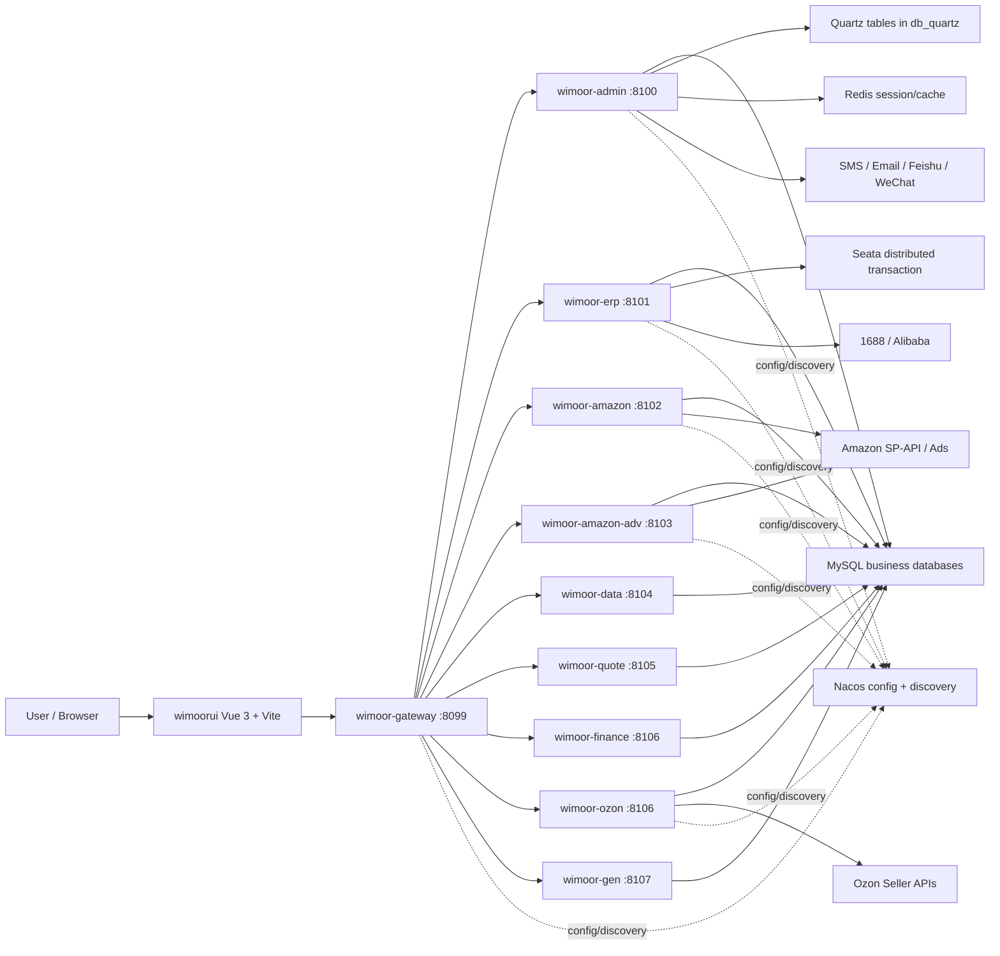

# Architecture

Wimoor 是跨境电商 ERP 系统，采用前后端分离和 Spring Cloud 微服务架构。前端 `wimoorui` 通过 Vite dev server 或静态部署访问后端，后端统一经过 `wimoor-gateway` 路由到各业务服务，服务注册与配置由 Nacos 承载，数据库按业务库拆分。

## System Context

## Runtime Layers

| Layer | Components | Responsibility |
| --- | --- | --- |
| Frontend | `wimoorui` | Vue pages, static routes, dynamic menu routes, API wrappers, permission directives |
| Gateway | `wimoor-gateway` | Path routing, ignore URL policy, service discovery routing |
| System/Admin | `wimoor-admin` | Login/SSO, user, role, menu, dict, file, task, notification, common tools |
| ERP Core | `wimoor-erp` | Material, inventory, warehouse, purchase, shipment, 1688 integration |
| Amazon | `wimoor-amazon` | Amazon auth, reports, orders, listing, product, inbound shipment, settlement |
| Amazon Ads | `wimoor-amazon-adv` | Ads auth, campaign, budget, keyword, report, invoice, schedule |
| Ozon | `wimoor-ozon` | Ozon auth, product, stock, price, posting, shipment, chat, finance, ads |
| Modules | `wimoor-data`, `wimoor-finance`, `wimoor-gen`, `wimoor-quote` | Data move, finance accounting, code generation, supplier quote |
| Common/API | `wimoor-common`, `wimoor-api`, module `*-api` | Shared entities, MVC, Redis, MyBatis, Swagger, Feign contracts |
| Bootstrap Config | `init-config` | MySQL schemas/seeds, Nacos config, Seata config, browser plugin resources |

## Core Request Shape

1. Browser loads `wimoorui`.
2. Vue Router checks white paths and session state.
3. Axios API wrappers call paths like `/erp/api/...`, `/amazon/api/...`, `/ozon/api/...`.
4. Vite dev proxy forwards to `http://localhost:8099`; deployed frontend calls the same gateway paths.
5. Gateway routes by Nacos-configured path predicates to `lb://service-name`.
6. Business service handles Controller -> Service -> Mapper -> MySQL, with Redis/Seata/Feign where needed.

## Important Observations

- Gateway routes are defined in `init-config/nacos/DEFAULT_GROUP/wimoor-gateway`, not in `wimoor-gateway/src/main/resources/bootstrap.yml`.
- `wimoor-ozon` and `wimoor-finance` both declare port `8106` in current dev/prod bootstrap files. This is a verified configuration conflict and remains marked as pending verification.
- `wimoor-erp/wimoor-erp-proxy` is a separate Spring Boot application named `proxy` on port `8080`, used for proxy/open integration endpoints and not routed through the main gateway config in the current Nacos file.

