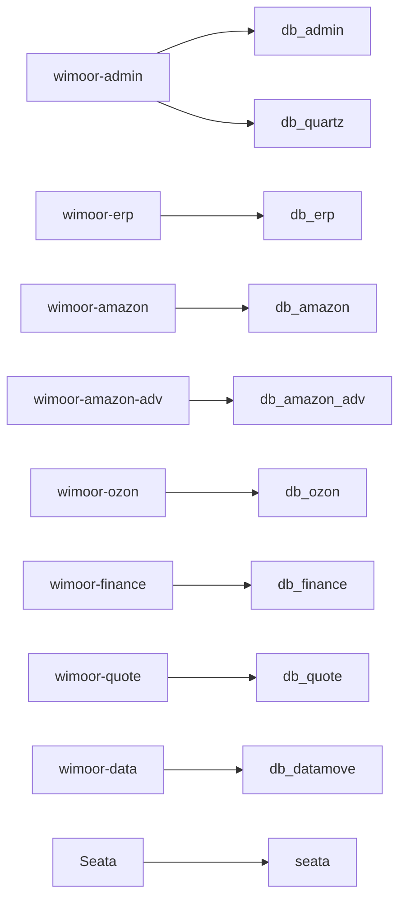

# Database Index

## Schema Inventory

Source: `init-config/mysql/数据库结构`.

| Database | SQL files | Owner |
| --- | ---: | --- |
| `db_admin` | 79 | `wimoor-admin` |
| `db_amazon` | 238 | `wimoor-amazon` |
| `db_amazon_adv` | 159 | `wimoor-amazon-adv` |
| `db_datamove` | 4 | `wimoor-data` |
| `db_erp` | 189 | `wimoor-erp` |
| `db_finance` | 24 | `wimoor-finance` |
| `db_ozon` | 34 | `wimoor-ozon` |
| `db_quartz` | 11 | Quartz scheduler |
| `db_quote` | 22 | `wimoor-quote` |
| `seata` | 4 | Seata server |

Total structure SQL files: 764.

## Seed Inventory

Source: `init-config/mysql/数据`.

| Database | Seed SQL files | Examples |
| --- | ---: | --- |
| `db_admin` | 15 | role, menu, permission, user, shop, dict, quartz task |
| `db_amazon` | 37 | marketplace, report request types, fees, exchange rates, product formats |
| `db_amazon_adv` | 3 | marketplace, region, report request types |
| `db_erp` | 9 | warehouse type, form type, transport, thirdparty system, marketplace |

Total seed SQL files: 64.

## Domain Data Flow

## Notes

- SQL file count treats one file as one table/bootstrap object. Confirm exact table count with MySQL after import if DDL files define more than one object.
- `db_datamove` has structure files in current repository even if earlier directory-only counts may miss them.
- Seed data includes operational defaults such as Quartz tasks; update seed docs together with runtime behavior changes.

