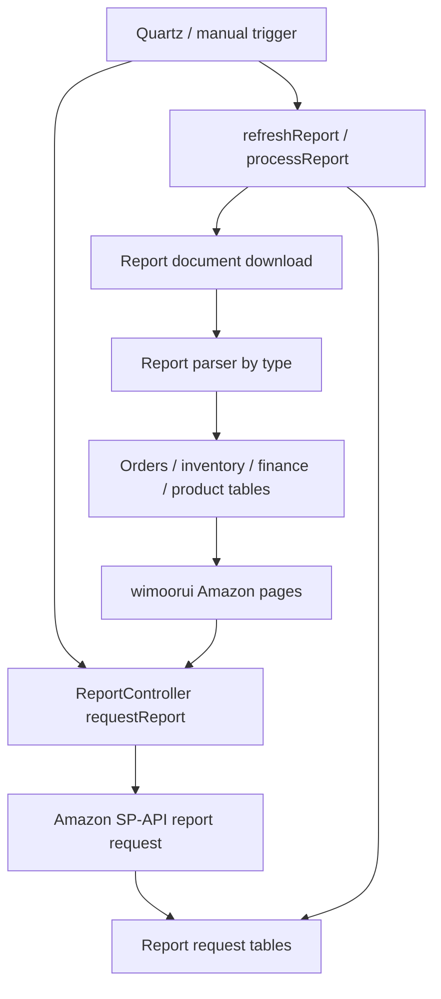

# Amazon Report Flow

Related controller families include `ReportController`, `AmzProductRefreshController`, `OrdersController`, `FeedController`, `AmzFinAccountController`, inbound shipment controllers and settlement controllers.

