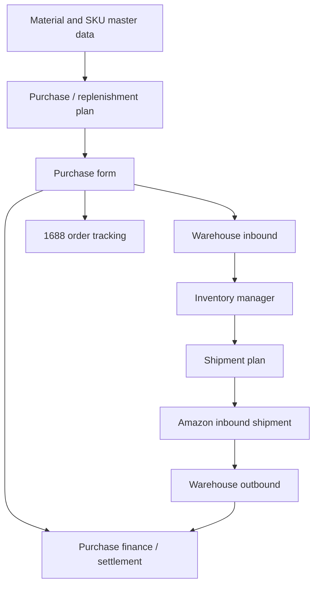

# ERP Purchase And Shipment Flow

Key backend families: `MaterialController`, `PlanController`, `PurchaseFormController`, `InventoryManagerController`, `WarehouseController`, `ShipPlanController`, `ShipFormController`, `AlibabaController`.

