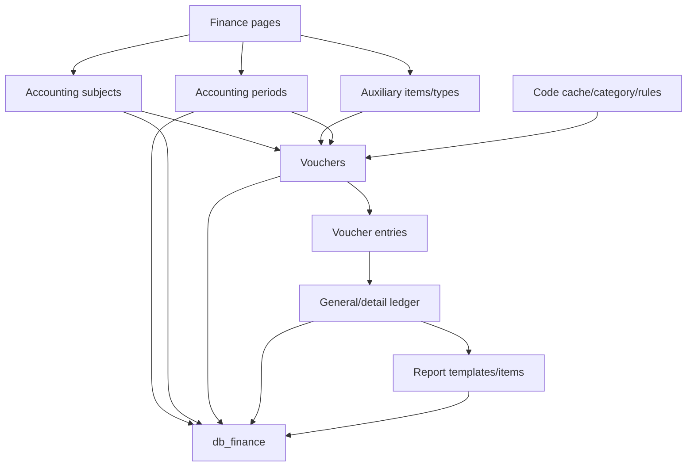

# Finance Flow

```mermaid
flowchart TB
  period["Accounting periods"]
  subjects["Accounting subjects"]
  auxiliary["Auxiliary items/types"]
  voucher["Vouchers"]
  entries["Voucher entries"]
  ledger["General/detail ledger"]
  report["Report templates/items"]
  code["Code cache/category/rules"]
  ui["Finance pages"]
  db["db_finance"]

  ui --> period
  ui --> subjects
  ui --> auxiliary
  subjects --> voucher
  auxiliary --> voucher
  period --> voucher
  voucher --> entries
  entries --> ledger
  ledger --> report
  code --> voucher
  period --> db
  subjects --> db
  voucher --> db
  ledger --> db
  report --> db
```

Frontend APIs live under `wimoorui/src/api/finance`, and service controllers live under `wimoor-modules/wimoor-finance`.

