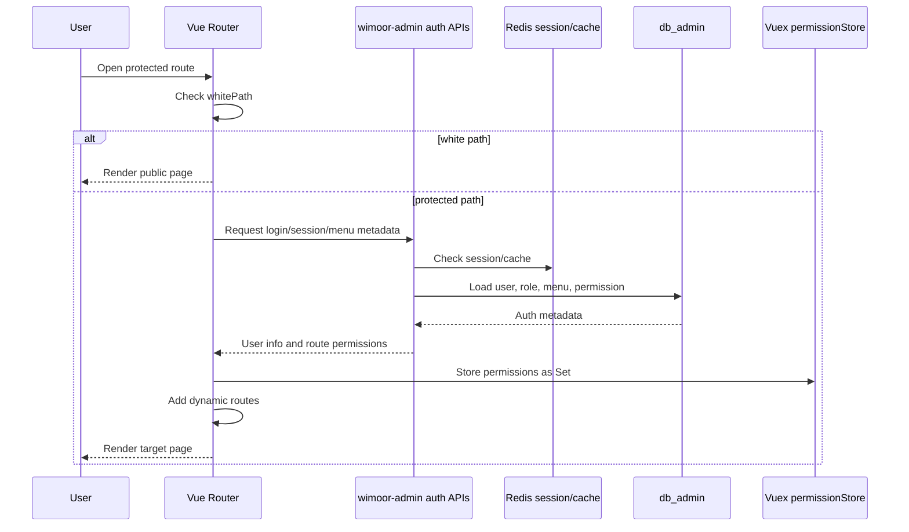

# Login And Auth Sequence

```mermaid
sequenceDiagram
  participant User as User
  participant Router as Vue Router
  participant Admin as wimoor-admin auth APIs
  participant Redis as Redis session/cache
  participant DB as db_admin
  participant Store as Vuex permissionStore

  User->>Router: Open protected route
  Router->>Router: Check whitePath
  alt white path
    Router-->>User: Render public page
  else protected path
    Router->>Admin: Request login/session/menu metadata
    Admin->>Redis: Check session/cache
    Admin->>DB: Load user, role, menu, permission
    DB-->>Admin: Auth metadata
    Admin-->>Router: User info and route permissions
    Router->>Store: Store permissions as Set
    Router->>Router: Add dynamic routes
    Router-->>User: Render target page
  end
```

White paths are defined in `wimoorui/src/router/index.js` and include SSO/login, register, reset password, quote and auth callback routes.

