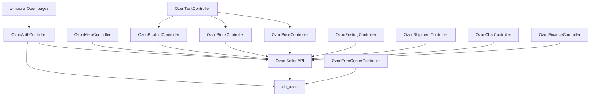

# Ozon Flow

```mermaid
flowchart TB
  auth["OzonAuthController"]
  meta["OzonMetaController"]
  product["OzonProductController"]
  stock["OzonStockController"]
  price["OzonPriceController"]
  posting["OzonPostingController"]
  shipment["OzonShipmentController"]
  chat["OzonChatController"]
  finance["OzonFinanceController"]
  task["OzonTaskController"]
  error["OzonErrorCenterController"]
  api["Ozon Seller API"]
  db["db_ozon"]
  ui["wimoorui Ozon pages"]

  ui --> auth
  auth --> db
  auth --> api
  meta --> api
  product --> api
  stock --> api
  price --> api
  posting --> api
  shipment --> api
  chat --> api
  finance --> api
  task --> product
  task --> stock
  task --> price
  api --> db
  error --> db
```

The Ozon module is newer than the README baseline and is included by the root POM and current gateway/Nacos route.

