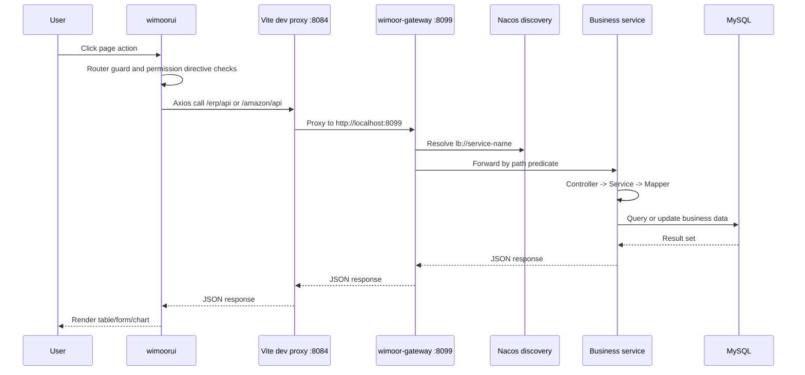

# Request Sequence

```mermaid
sequenceDiagram
  participant User as User
  participant UI as wimoorui
  participant Vite as Vite dev proxy :8084
  participant Gateway as wimoor-gateway :8099
  participant Nacos as Nacos discovery
  participant Service as Business service
  participant DB as MySQL

  User->>UI: Click page action
  UI->>UI: Router guard and permission directive checks
  UI->>Vite: Axios call /erp/api or /amazon/api
  Vite->>Gateway: Proxy to http://localhost:8099
  Gateway->>Nacos: Resolve lb://service-name
  Gateway->>Service: Forward by path predicate
  Service->>Service: Controller -> Service -> Mapper
  Service->>DB: Query or update business data
  DB-->>Service: Result set
  Service-->>Gateway: JSON response
  Gateway-->>Vite: JSON response
  Vite-->>UI: JSON response
  UI-->>User: Render table/form/chart
```

Production deployment removes the Vite proxy hop, but keeps the same gateway path model.

