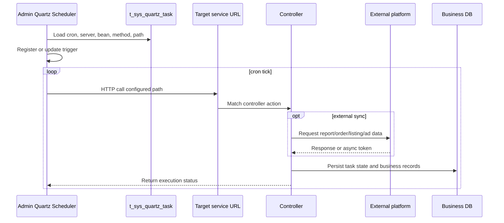

# Scheduled Task Sequence

```mermaid
sequenceDiagram
  participant Quartz as Admin Quartz Scheduler
  participant TaskTable as t_sys_quartz_task
  participant Target as Target service URL
  participant Service as Controller
  participant External as External platform
  participant DB as Business DB

  Quartz->>TaskTable: Load cron, server, bean, method, path
  Quartz->>Quartz: Register or update trigger
  loop cron tick
    Quartz->>Target: HTTP call configured path
    Target->>Service: Match controller action
    opt external sync
      Service->>External: Request report/order/listing/ad data
      External-->>Service: Response or async token
    end
    Service->>DB: Persist task state and business records
    Service-->>Quartz: Return execution status
  end
```

Seeded tasks currently target `wimoor-amazon`, `wimoor-amazon-adv`, and `wimoor-erp`.

