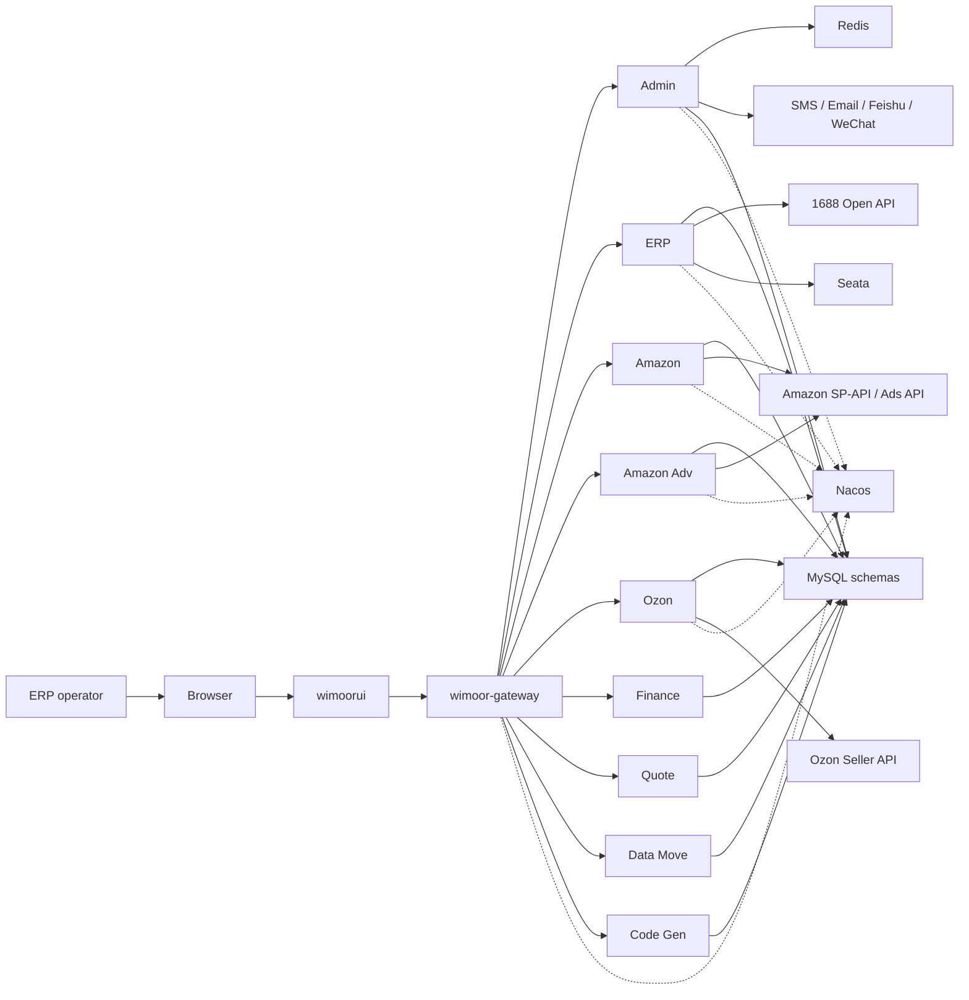

# System Context Flow

```mermaid
flowchart LR
  user["ERP operator"]
  browser["Browser"]
  ui["wimoorui"]
  gateway["wimoor-gateway"]
  nacos["Nacos"]
  redis["Redis"]
  seata["Seata"]
  mysql["MySQL schemas"]
  amazonApi["Amazon SP-API / Ads API"]
  ozonApi["Ozon Seller API"]
  alibabaApi["1688 Open API"]
  msgApi["SMS / Email / Feishu / WeChat"]

  user --> browser --> ui --> gateway
  gateway --> admin["Admin"]
  gateway --> erp["ERP"]
  gateway --> amazon["Amazon"]
  gateway --> adv["Amazon Adv"]
  gateway --> ozon["Ozon"]
  gateway --> finance["Finance"]
  gateway --> quote["Quote"]
  gateway --> data["Data Move"]
  gateway --> gen["Code Gen"]

  admin --> redis
  admin --> msgApi
  admin --> mysql
  erp --> mysql
  erp --> alibabaApi
  erp --> seata
  amazon --> mysql
  amazon --> amazonApi
  adv --> mysql
  adv --> amazonApi
  ozon --> mysql
  ozon --> ozonApi
  finance --> mysql
  quote --> mysql
  data --> mysql
  gen --> mysql

  gateway -.-> nacos
  admin -.-> nacos
  erp -.-> nacos
  amazon -.-> nacos
  adv -.-> nacos
  ozon -.-> nacos
```

