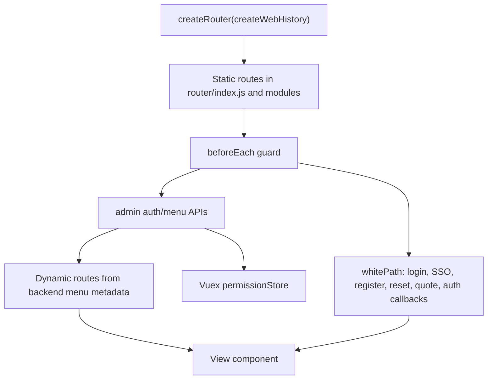

# Frontend Map

## Frontend Stack

| Area | Current baseline |
| --- | --- |
| App root | `wimoorui` |
| Framework | Vue 3 |
| Build tool | Vite |
| UI library | Element Plus |
| Router/state | Vue Router 4, Vuex 4 |
| HTTP client | Axios wrappers under `wimoorui/src/api` |
| Dev server | `8084` |
| Backend proxy | `http://localhost:8099` |

## Vite Proxy Map

Source: `wimoorui/vite.config.js`.

| Frontend path | Target |
| --- | --- |
| `/api` | rewrite to gateway root |
| `/admin/api` | `wimoor-gateway` |
| `/erp/api` | `wimoor-gateway` |
| `/amazon/api` | `wimoor-gateway` |
| `/amazonadv/api` | `wimoor-gateway` |
| `/ozon/api` | `wimoor-gateway` |
| `/quote/api` | `wimoor-gateway` |
| `/chelsea/api` | `wimoor-gateway` |
| `/mdata/api` | `wimoor-gateway` |
| `/finance/api` | `wimoor-gateway` |
| `/code/gen` | `wimoor-gateway` |

## Router Model

## Route Modules

| File | Path entries | Main responsibility |
| --- | ---: | --- |
| `wimoorui/src/router/index.js` | 4 | root layout, home, blank, user center, route guard |
| `wimoorui/src/router/modules/sysRouter.js` | 8 | login, SSO, register, reset password, public callbacks |
| `wimoorui/src/router/modules/erp.js` | 41 | shipment steps, purchase/warehouse detail pages, ERP foundation |
| `wimoorui/src/router/modules/amazon.js` | 12 | shipment detail, listing edit/catalog, ad create, finance edit |
| `wimoorui/src/router/modules/ozon.js` | 11 | auth, product, stock, price, chat, ads, finance, posting, shipment, task, error |
| `wimoorui/src/router/modules/finance.js` | 2 | code generation edit page |

## API Domains

| Domain | Files | Gateway path |
| --- | ---: | --- |
| `amazon` | 73 | `/amazon/api`, `/amazonadv/api` depending subdomain |
| `erp` | 58 | `/erp/api` |
| `finance` | 14 | `/finance/api` |
| `ozon` | 13 | `/ozon/api` |
| `quote` | 4 | `/quote/api` |
| `sys` | 28 | `/admin/api`, `/code/gen`, tooling paths |

## Permission Flow

- `wimoorui/src/router/index.js` owns route guard and white path checks.
- `wimoorui/src/store/modules/permission.js` stores permissions in a `Set`.
- `wimoorui/src/main.js` registers permission directives from `@/directive/permission.js`.
- Backend menu/permission metadata drives dynamic routes and route-level access.

