# Module Map

## Maven Module Tree

```mermaid
flowchart TB
  root["wimoor-all"]
  root --> common["wimoor-common"]
  root --> admin["wimoor-admin"]
  root --> gateway["wimoor-gateway"]
  root --> erp["wimoor-erp"]
  root --> amazon["wimoor-amazon"]
  root --> adv["wimoor-amazon-adv"]
  root --> ozon["wimoor-ozon"]
  root --> api["wimoor-api"]
  root --> modules["wimoor-modules"]

  common --> core["common-core"]
  common --> mvc["common-mvc"]
  common --> mybatis["common-mybatis"]
  common --> redis["common-redis"]
  common --> storage["common-storage"]
  common --> swagger["common-swagger"]

  admin --> adminApi["admin-api"]
  admin --> adminBoot["admin-boot"]
  erp --> erpApi["erp-api"]
  erp --> erpBoot["erp-boot"]
  erp --> erpProxy["wimoor-erp-proxy"]
  amazon --> amazonApi["amazon-api"]
  amazon --> spApi["amazon-sp-api"]
  amazon --> amazonBoot["amazon-boot"]
  adv --> advApi["amazon-adv-api"]
  adv --> advBoot["amazon-adv-boot"]
  ozon --> ozonApi["ozon-api"]
  ozon --> ozonBoot["ozon-boot"]
  modules --> quote["wimoor-quote"]
  modules --> data["wimoor-data"]
  modules --> gen["wimoor-gen"]
  modules --> finance["wimoor-finance"]
```

## Boot Applications

| Service | Module | Main class | Service name | Port | Gateway path |
| --- | --- | --- | --- | --- | --- |
| Gateway | `wimoor-gateway` | `com.wimoor.GatewayApplication` | `wimoor-gateway` | `8099` | external entry |
| Admin | `wimoor-admin/admin-boot` | `com.wimoor.AdminApplication` | `wimoor-admin` | `8100` | `/admin/**` |
| ERP | `wimoor-erp/erp-boot` | `com.wimoor.ERPApplication` | `wimoor-erp` | `8101` | `/erp/**` |
| Amazon | `wimoor-amazon/amazon-boot` | `com.wimoor.AmazonApplication` | `wimoor-amazon` | `8102` | `/amazon/**` |
| Amazon Adv | `wimoor-amazon-adv/amazon-adv-boot` | `com.wimoor.AmazonAdvApplication` | `wimoor-amazon-adv` | `8103` | `/amazonadv/**` |
| Data Move | `wimoor-modules/wimoor-data` | `com.wimoor.DataApplication` | `wimoor-data` | `8104` | `/mdata/**` |
| Quote | `wimoor-modules/wimoor-quote` | `com.wimoor.QuoteApplication` | `wimoor-quote` | `8105` | `/quote/**` |
| Finance | `wimoor-modules/wimoor-finance` | `com.wimoor.WimoorFinanceApplication` | `wimoor-finance` | `8106` | `/finance/**` |
| Ozon | `wimoor-ozon/ozon-boot` | `com.wimoor.OzonApplication` | `wimoor-ozon` | `8106` | `/ozon/**` |
| Code Gen | `wimoor-modules/wimoor-gen` | `com.wimoor.WimoorGenApplication` | `wimoor-gen` | `8107` | `/code/**` |
| ERP Proxy | `wimoor-erp/wimoor-erp-proxy` | `com.wimoor.ProxyApplication` | `proxy` | `8080` | not in gateway Nacos route |

## Module Responsibilities

| Module | Responsibility | Main data/config |
| --- | --- | --- |
| `wimoor-common` | Shared core, MVC, MyBatis, Redis, storage, Swagger, common entities | Common dependencies, shared annotations, exception handling |
| `wimoor-api` | Cross-service Feign contracts for Amazon, Ozon, Quote | Remote service interface constants and fallback contracts |
| `wimoor-admin` | User, role, menu, permission, login, notification, Quartz task management | `db_admin`, `db_quartz`, Redis session/cache |
| `wimoor-gateway` | Spring Cloud Gateway entry and security ignore URL policy | Nacos `wimoor-gateway` config |
| `wimoor-erp` | ERP core: material, purchase, inventory, warehouse, shipment, 1688 | `db_erp`, shared Amazon/ERP Feign calls |
| `wimoor-amazon` | Amazon seller data, SP-API, reports, feeds, orders, listing, finance | `db_amazon`, Amazon external APIs |
| `wimoor-amazon-adv` | Amazon Ads campaign, report, invoice and scheduling | `db_amazon_adv`, Amazon Ads external APIs |
| `wimoor-ozon` | Ozon local module: auth, products, stock, price, posting, chat, finance | `db_ozon`, Ozon external APIs |
| `wimoor-modules` | Quote, data migration, finance accounting, code generation | `db_quote`, `db_datamove`, `db_finance` |

## Cross-Service Contracts

| Contract module | Feign client | Target service |
| --- | --- | --- |
| `wimoor-admin/admin-api` | `AdminClientOneFeign` | `wimoor-admin` |
| `wimoor-erp/erp-api` | `ErpClientOneFeign` | `wimoor-erp` |
| `wimoor-amazon/amazon-api` | `AmazonClientOneFeign` | `wimoor-amazon` |
| `wimoor-amazon-adv/amazon-adv-api` | `AmazonAdvFeignClient` | `wimoor-amazon-adv` |
| `wimoor-api/wimoor-api-amazon` | `RemoteAmazonService` | Amazon service constant |
| `wimoor-api/wimoor-api-ozon` | `RemoteOzonService` | Ozon service constant |
| `wimoor-api/wimoor-api-quote` | `QuoteClientOneFeign` | `wimoor-quote` |
| `wimoor-erp/erp-boot` | `AmazonClientOneFeignApi` | `wimoor-amazon` |

