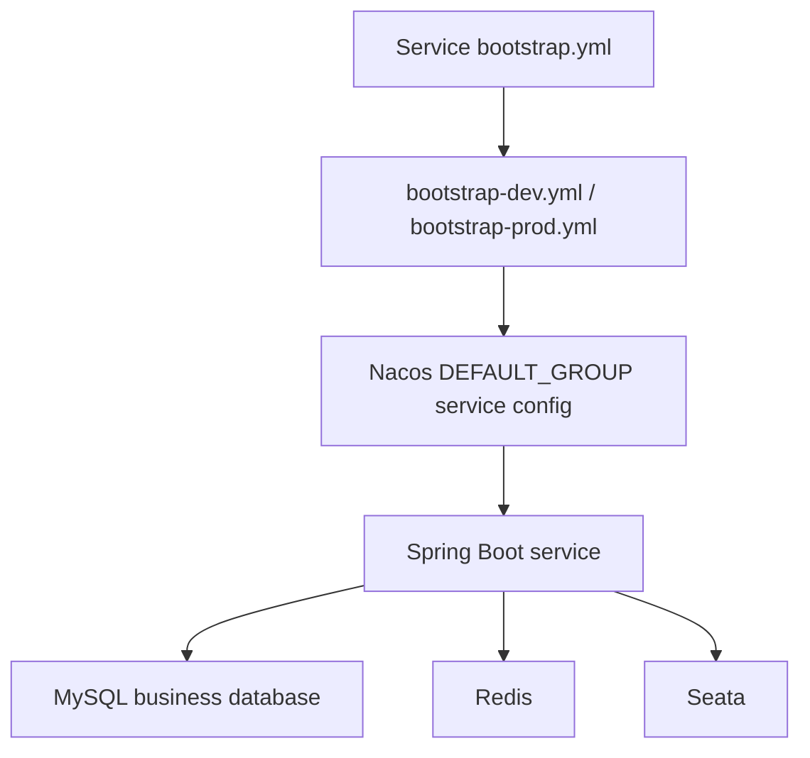

# Runtime Config

## Config Loading Model

Each boot service has local `bootstrap.yml` selecting the active profile and profile files containing `server.port`, `spring.application.name`, and Nacos discovery/config settings. Business datasource, Feign timeout, gateway routes, Seata and external integration keys are primarily provided by `init-config/nacos/DEFAULT_GROUP`.

## Gateway Routes

Source: `init-config/nacos/DEFAULT_GROUP/wimoor-gateway`.

| Route id | URI | Predicate |
| --- | --- | --- |
| `admin-server` | `lb://wimoor-admin` | `/admin/**` |
| `wimoor-erp` | `lb://wimoor-erp` | `/erp/**` |
| `wimoor-amazon` | `lb://wimoor-amazon` | `/amazon/**` |
| `wimoor-amazon-adv` | `lb://wimoor-amazon-adv` | `/amazonadv/**` |
| `wimoor-ozon` | `lb://wimoor-ozon` | `/ozon/**` |
| `wimoor-quote` | `lb://wimoor-quote` | `/quote/**` |
| `wimoor-data` | `lb://wimoor-data` | `/mdata/**` |
| `wimoor-finance` | `lb://wimoor-finance` | `/finance/**` |
| `wimoor-gen` | `lb://wimoor-gen` | `/code/**` |

Security ignore URLs include auth, registration, SMS, seller auth callback, 1688 callback, quote supplier public submission and selected webhook paths. Keep the source Nacos file as the authority for exact ignore path additions.

## Service Config Inventory

| Config file | Main topics | Sensitive handling |
| --- | --- | --- |
| `wimoor-admin` | `db_admin`, `db_quartz`, Quartz JDBC store, mail, SMS, CAS, WeChat, Feishu, DeepSeek | Store only keys in docs; values are `<redacted>` |
| `wimoor-erp` | `db_erp`, 1688 credentials, multipart, Feign timeout, other table references | Keys only; `appKey`, `appSecret` redacted |
| `wimoor-amazon` | `db_amazon`, Amazon integration, Feign/load balancer | Credentials redacted |
| `wimoor-amazon-adv` | `db_amazon_adv`, Amazon Ads integration | Credentials redacted |
| `wimoor-ozon` | `db_ozon`, Ozon local module config | Tokens/secrets redacted |
| `wimoor-finance` | `db_finance`, accounting/code generation config | Credentials redacted |
| `wimoor-data` | `db_datamove`, data migration config | Credentials redacted |
| `wimoor-quote` | `db_quote`, supplier quote config | Credentials redacted |
| `seataServer.properties` | Seata registry/store settings | Password/token keys redacted |

## Databases

| Database | Primary owner | Notes |
| --- | --- | --- |
| `db_admin` | `wimoor-admin` | users, roles, menus, permissions, dicts, tasks, customer/order admin data |
| `db_quartz` | `wimoor-admin` / Quartz | scheduler tables and job trigger state |
| `db_erp` | `wimoor-erp` | material, warehouse, purchase, inventory, shipment, 1688 |
| `db_amazon` | `wimoor-amazon` | Amazon auth, marketplace, orders, reports, products, inbound, settlement |
| `db_amazon_adv` | `wimoor-amazon-adv` | Ads campaign/report/account data |
| `db_ozon` | `wimoor-ozon` | Ozon auth, listings, posting, stock, price, finance, chat |
| `db_finance` | `wimoor-finance` | accounting subjects, vouchers, ledgers, report templates |
| `db_quote` | `wimoor-quote` | supplier quote, shipment, purchase quote forms |
| `db_datamove` | `wimoor-data` | data migration support |
| `seata` | Seata server | distributed transaction metadata |

## Known Config Risks

- `wimoor-ozon` and `wimoor-finance` both declare `server.port: 8106` in dev/prod bootstrap files. This is a verified pending issue: `待核验端口冲突`.
- `init-config/nacos/DEFAULT_GROUP/wimoor-admin` contains example credential-looking values for mail/SMS/WeChat/Feishu/DeepSeek. Documentation must not copy raw values; use `<redacted>`.
- README mentions older framework versions and startup list that may not include Ozon. The root POM and current config are treated as the fresher baseline for this document set.

