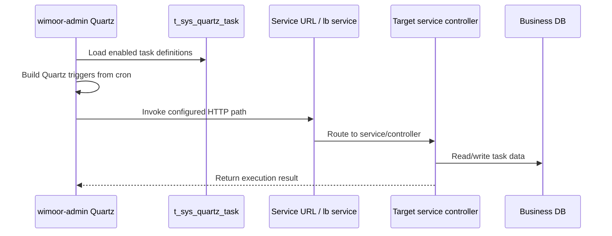

# Scheduled Jobs

Quartz tasks are seeded from `init-config/mysql/数据/db_admin/t_sys_quartz_task.sql` and persisted by Admin service Quartz JDBC configuration against `db_quartz`.

## Job Execution Model

## Target Service Distribution

| Target service | Seed tasks |
| --- | ---: |
| `wimoor-amazon` | 53 |
| `wimoor-amazon-adv` | 9 |
| `wimoor-erp` | 2 |

## Business Group Distribution

| Group | Seed tasks |
| --- | ---: |
| `亚马逊报表` | 29 |
| `亚马逊广告` | 9 |
| `亚马逊商品` | 5 |
| `亚马逊财务` | 4 |
| `亚马逊订单` | 4 |
| `亚马逊汇总` | 3 |
| `亚马逊消息` | 2 |
| `阿里巴巴` | 1 |
| `进销存` | 1 |
| `亚马逊产品` | 1 |
| `亚马逊模块` | 1 |
| `亚马逊权限` | 1 |
| `亚马逊授权` | 1 |
| `亚马逊FBA` | 1 |
| `亚马逊Feed` | 1 |

## Typical Job Families

| Family | Example target path | Effect |
| --- | --- | --- |
| Amazon report request | `/amazon/api/v1/report/requestReport/{type}` | request report generation from Amazon |
| Amazon report processing | `/amazon/api/v1/report/processReport` | process downloaded report records |
| Amazon product refresh | `/amazon/api/v1/report/product/amzProductRefresh/refresh` | refresh product/listing data |
| Amazon order refresh | `/amazon/api/v0/orders/refreshOrder` | synchronize order data |
| Amazon Ads report | `/amazonadv/api/v1/advschedule/requestReport` | request ads reports |
| ERP inventory report | `/erp/api/v1/inventory/report/monthsummary` | generate turnover/inventory summary |
| 1688 tracking | `/erp/api/v1/purchase_form/refreshAlibabaOrder` | refresh Alibaba order tracking |

