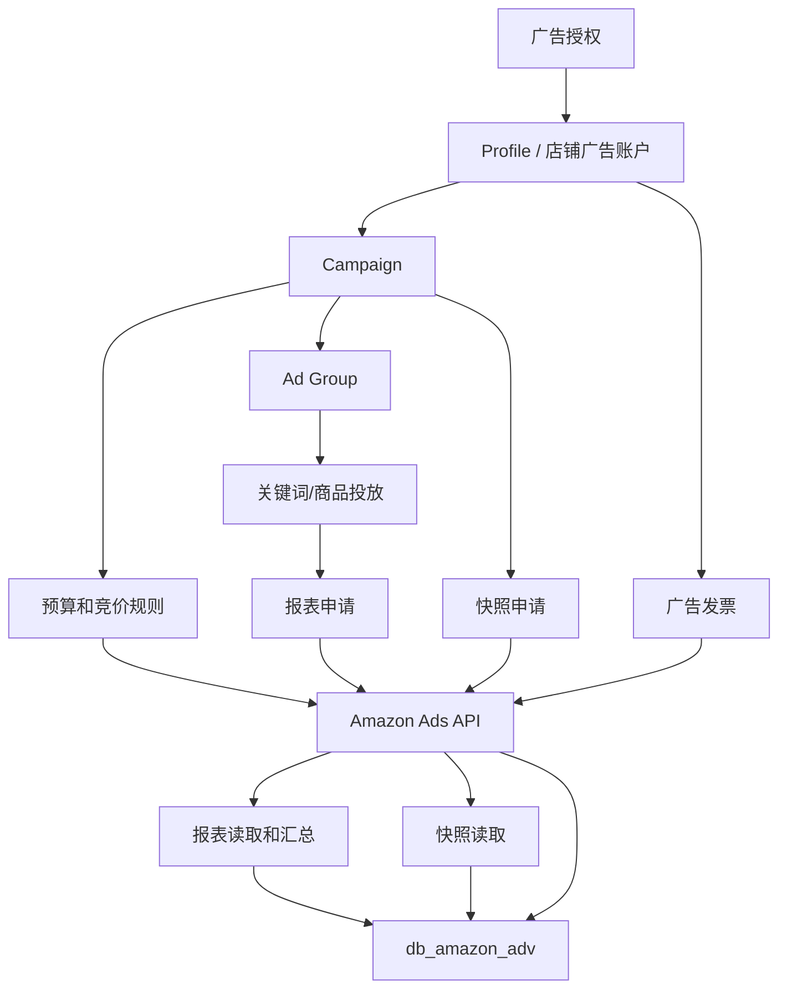
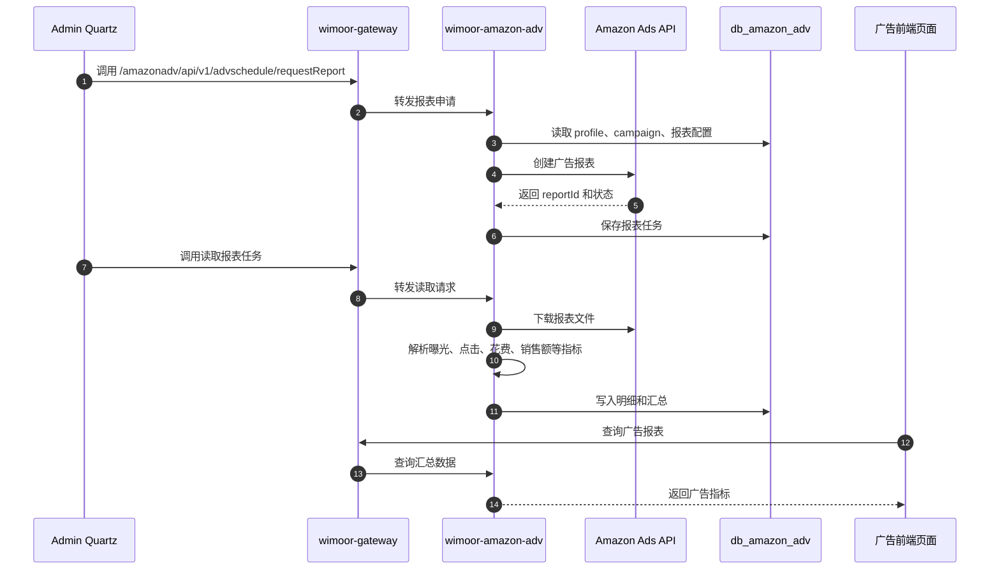
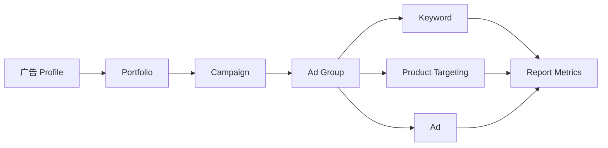

# Amazon Ads

Amazon Ads 能力由 `wimoor-amazon-adv/amazon-adv-boot` 承载，网关路径为 `/amazonadv/**`。它负责广告授权、广告结构管理、预算竞价、广告报表、快照和发票数据。

## 功能范围

- 广告授权。
- 广告活动、广告组、广告、关键词、商品投放。
- 预算规则、竞价规则、Portfolio。
- 广告报表申请、读取和汇总。
- 广告快照申请、读取和处理。
- 广告发票和操作日志。

## 模块边界

| 层级 | 位置 | 职责 |
| --- | --- | --- |
| 前端 API | `wimoorui/src/api/amazon` 下广告相关文件 | Campaign、报表、预算、发票等请求 |
| 后端服务 | `wimoor-amazon-adv/amazon-adv-boot` | Amazon Ads Controller、调度入口和业务处理 |
| Feign | `wimoor-amazon-adv/amazon-adv-api` | 广告发票汇总等跨服务契约 |
| 数据库 | `db_amazon_adv` | 广告账户、Campaign、报表、发票数据 |
| 调度 | `wimoor-admin` Quartz | 调用 Ads 报表、快照、Portfolio 更新任务 |

## 广告业务流程图

## 广告报表时序图

## 广告结构关系图

## 关键数据和接口

| 类型 | 说明 |
| --- | --- |
| 网关路径 | `/amazonadv/**` |
| API 前缀 | `/amazonadv/api/v1/**` |
| 主要 API 家族 | ads、campaign、budget rules、keywords、product targeting、stores、report、invoices、schedule |
| 主要数据库 | `db_amazon_adv` |
| 外部依赖 | Amazon Ads API |
| 典型任务 | 报表申请、报表读取、快照申请、快照读取、Portfolio 更新 |

## 排错关注点

- 广告账户为空：检查广告授权、profile 同步和店铺绑定关系。
- 报表无数据：检查报表日期、profile、campaign 状态和 Ads API 返回状态。
- 快照读取失败：检查快照任务是否已完成，以及下载链接是否过期。
- 发票汇总不一致：检查币种、日期区间、profile 过滤条件和跨服务调用结果。
