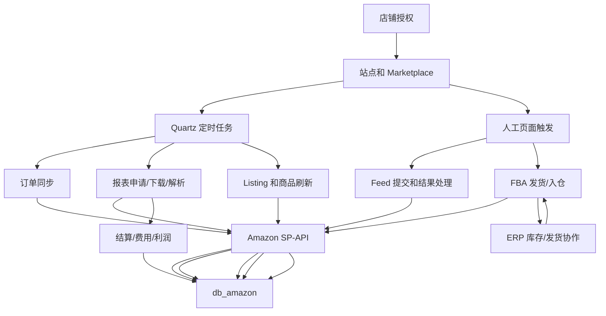
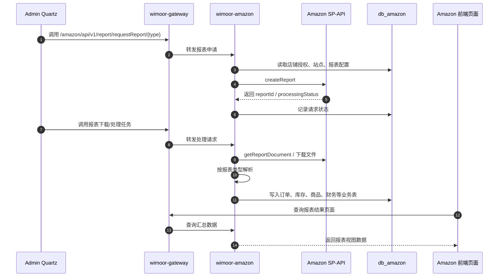
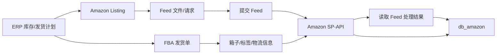

# Amazon

Amazon 能力由 `wimoor-amazon/amazon-boot` 承载，网关路径为 `/amazon/**`。该模块负责 Amazon 店铺授权、SP-API 数据同步、报表、订单、Listing、Feed、FBA 发货、财务结算和利润分析。

## 功能范围

- Amazon 店铺授权、区域、站点和 marketplace。
- 订单同步、订单汇总、订单消息、退货和发票。
- 报表申请、下载、解析和处理。
- Listing、商品信息、价格、排名、流量和销售分析。
- Feed 提交和处理。
- FBA 入仓、发货、箱子、运输、费用和标签。
- 财务结算、仓储费、赔偿费、利润参数和汇率。
- Transparency 透明计划管理。

## 模块边界

| 层级 | 位置 | 职责 |
| --- | --- | --- |
| 前端 API | `wimoorui/src/api/amazon` | 授权、订单、报表、Listing、Feed、FBA、财务页面请求 |
| 前端路由 | `wimoorui/src/router/modules/amazon.js` | 发货详情、Listing 编辑、广告创建、财务编辑等页面 |
| 后端服务 | `wimoor-amazon/amazon-boot` | Amazon 业务 Controller 和任务入口 |
| SP-API SDK | `wimoor-amazon/amazon-sp-api` | Amazon SP-API 调用封装 |
| 数据库 | `db_amazon` | 店铺、订单、报表、商品、发货、结算数据 |
| 调度 | `wimoor-admin` Quartz | 定时触发报表、订单、商品、库存、财务任务 |

## 总体流程图

## 报表处理时序图

## Feed 和 FBA 协作图

## 关键数据和接口

| 类型 | 说明 |
| --- | --- |
| 网关路径 | `/amazon/**` |
| API 前缀 | `/amazon/api/v0/**`、`/amazon/api/v1/**`、`/amazon/api/v2/**` |
| 主要 API 家族 | authority、marketplace、reports、orders、product/listing、feed、inbound shipment、settlement、profit、transparency |
| 主要数据库 | `db_amazon` |
| 外部依赖 | Amazon SP-API |
| 定时任务 | 报表申请、报表处理、订单刷新、商品刷新、库存刷新、财务处理 |

## 排错关注点

- 授权店铺不可用：检查授权状态、站点、区域、refresh token 是否过期。
- 报表一直处理中：检查 Amazon 报表状态、下载任务是否执行、报表类型是否有数据。
- 订单或 Listing 不刷新：检查 Quartz 任务、店铺授权、SP-API 限流和接口错误日志。
- Feed 提交失败：检查 feed 类型、文件内容、站点和 Amazon 返回的 processing report。
- FBA 发货失败：检查 ERP 库存、箱规、站点、货件状态和 SP-API 返回错误。
