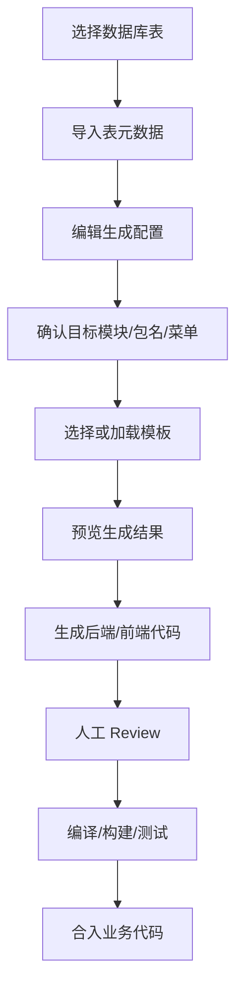
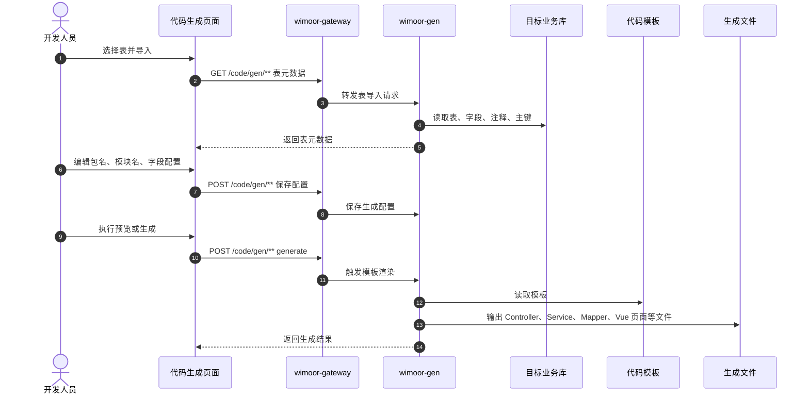

# 代码生成

代码生成能力由 `wimoor-modules/wimoor-gen` 承载，网关路径为 `/code/**`。它用于导入数据库表、编辑生成配置、渲染代码模板，并辅助生成后端和前端页面骨架。

## 功能范围

- 数据表导入。
- 生成配置编辑。
- 代码模板生成。
- 前端生成页面联动。
- 生成结果下载、复制或落地到目标模块。

## 模块边界

| 层级 | 位置 | 职责 |
| --- | --- | --- |
| 前端路由 | `wimoorui/src/router/modules/finance.js` 中工具路由 | `/tool/gen-edit` 等生成配置页面 |
| 前端 API | `wimoorui/src/api/sys` 或代码生成相关 API | 表导入、配置保存、生成请求 |
| 后端服务 | `wimoor-modules/wimoor-gen` | 表元数据读取、模板渲染、代码生成 |
| 网关路径 | `/code/**` | 转发代码生成请求 |
| 数据源 | 业务数据库结构 | 读取表、字段、注释、类型和主键信息 |

## 代码生成流程图

## 生成操作时序图

## 生成后验证流程图

## 关键数据和接口

| 类型 | 说明 |
| --- | --- |
| 网关路径 | `/code/**` |
| 常见前端入口 | `/tool/gen-edit` |
| 主要能力 | table import、generate config、template render、file output |
| 输入来源 | 数据库表结构、字段注释、主键、类型映射 |
| 输出对象 | Java Controller/Service/Mapper、XML、Vue 页面、API 文件等 |

## 使用要求

- 生成前确认目标模块、包名、表结构、主键和覆盖策略。
- 生成结果必须人工 review，不要直接覆盖已有业务逻辑。
- 生成后至少执行后端编译或目标模块测试；涉及前端页面时需要手动打开页面验证。
- 如果生成文件与现有代码重名，先比较差异，再决定覆盖、合并或放弃。

## 排错关注点

- 表导入失败：检查数据库连接、表名、权限和表注释。
- 字段类型不正确：检查类型映射、数据库字段类型和生成配置。
- 生成文件路径错误：检查模块名、包名、前端目录和模板变量。
- 编译失败：检查依赖、import、实体字段、Mapper XML 和接口路径是否一致。
