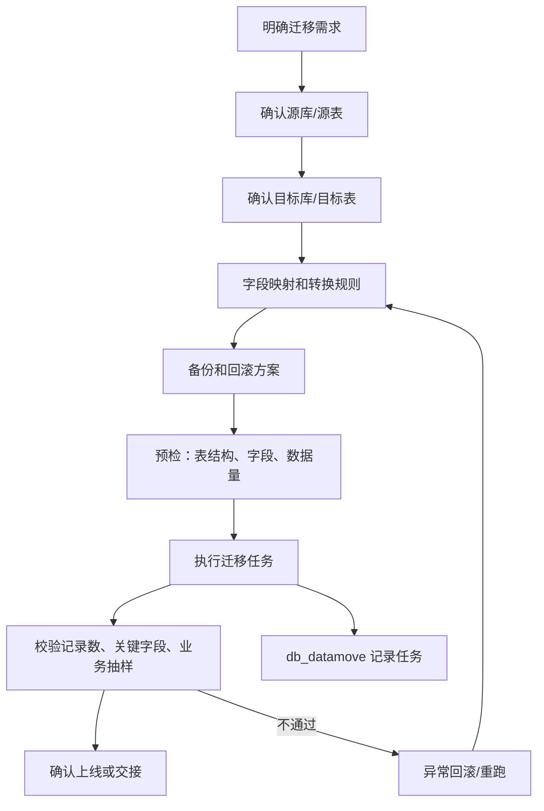
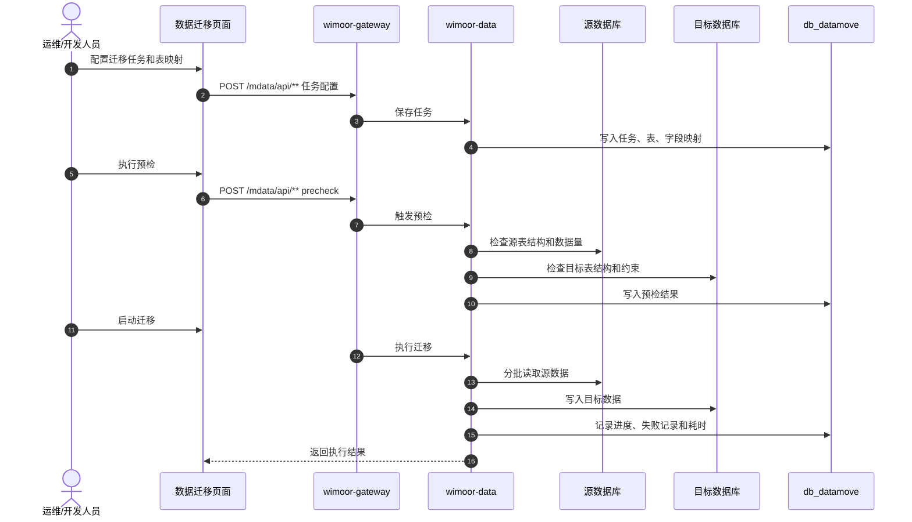

# 数据迁移

数据迁移能力由 `wimoor-modules/wimoor-data` 承载，网关路径为 `/mdata/**`。它用于迁移任务、迁移表信息、跨库或历史数据搬迁辅助。

## 功能范围

- 数据迁移任务。
- 迁移表信息。
- 跨库或历史数据搬迁辅助。
- 迁移前预检、执行后比对和异常记录。

## 模块边界

| 层级 | 位置 | 职责 |
| --- | --- | --- |
| 前端 API | `wimoorui/src/api/sys` 或数据迁移相关 API | 迁移任务配置和执行请求 |
| 后端服务 | `wimoor-modules/wimoor-data` | 数据迁移 Controller、Service、Mapper |
| 数据库 | `db_datamove` | 迁移任务、迁移表、迁移配置和执行记录 |
| 关联数据源 | 业务库 | 源库、目标库、历史库或临时库 |

## 迁移治理流程图

## 迁移执行时序图

## 数据校验流程图

## 关键数据和接口

| 类型 | 说明 |
| --- | --- |
| 网关路径 | `/mdata/**` |
| API 前缀 | `/mdata/api/**` |
| 主要能力 | data move、table move、history data migration |
| 主要数据库 | `db_datamove` |
| 关联对象 | 源库、目标库、历史库、临时表 |

## 使用要求

- 生产数据迁移前必须确认备份、回滚策略、执行窗口和数据校验口径。
- 不要在未备份的生产库上直接执行迁移。
- 迁移任务应先在测试库或备份库演练。
- 涉及跨业务库迁移时，应由业务负责人确认字段映射和验收样本。

## 排错关注点

- 预检失败：检查源表、目标表、字段类型、索引和必填约束。
- 执行中断：检查批次大小、数据库连接、超时和失败记录。
- 记录数不一致：检查过滤条件、去重逻辑、增量时间范围和异常跳过策略。
- 业务校验不通过：检查字段转换、枚举映射、关联表顺序和历史数据质量。
