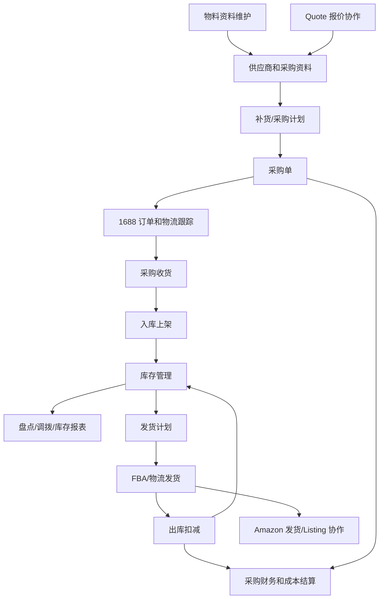
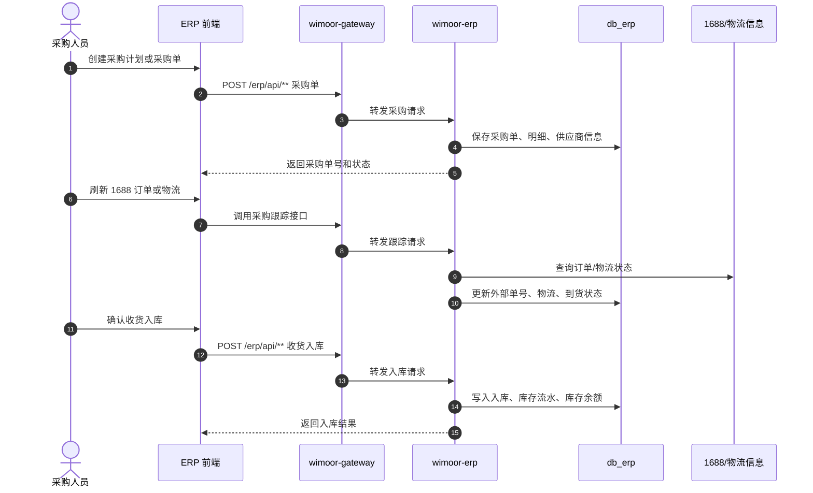
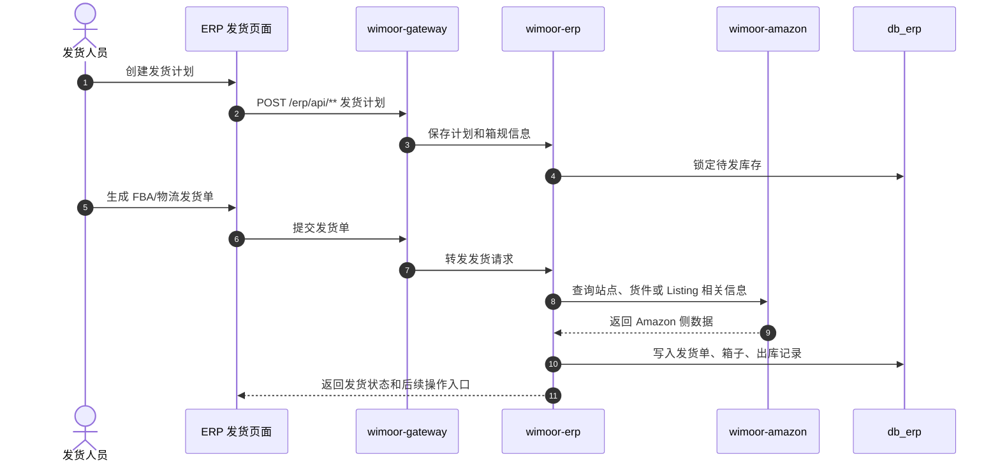

# ERP 核心

ERP 核心能力由 `wimoor-erp/erp-boot` 承载，网关路径为 `/erp/**`。它负责跨境电商内部的物料、采购、仓库、库存、发货和采购财务，是 Amazon、Quote、Finance 等模块的业务基础。

## 功能范围

- 物料、品牌、分类、海关、采购资料。
- 采购计划、采购单、采购变更、采购收货。
- 1688 采购订单、物流跟踪和结算信息。
- 仓库、货架、入库、出库、盘点、调拨。
- 发货计划、FBA 发货、运输方式、箱规和报关信息。
- 库存报表、周转率、滞销分析。
- 与 Amazon 发货、Quote 报价、Admin 基础资料的服务协作。

## 模块边界

| 层级 | 位置 | 职责 |
| --- | --- | --- |
| 前端 API | `wimoorui/src/api/erp` | 物料、采购、库存、仓库、发货页面请求 |
| 前端路由 | `wimoorui/src/router/modules/erp.js` | ERP 详情页、采购仓库、发货步骤页 |
| 后端服务 | `wimoor-erp/erp-boot` | ERP Controller、Service、Mapper |
| Feign | `wimoor-erp/erp-api`、`AmazonClientOneFeignApi` | ERP 内部契约、ERP 调 Amazon |
| 数据库 | `db_erp` | 物料、采购、库存、仓库、发货数据 |

## 核心业务流程图

## 采购入库时序图

## 发货出库时序图

## 关键数据和接口

| 类型 | 说明 |
| --- | --- |
| 网关路径 | `/erp/**` |
| API 前缀 | `/erp/api/v1/**`、`/erp/api/v2/**` |
| 主要 API 家族 | material、category、brand、purchase plan/form、inventory、warehouse、stocktaking、shipment plan/form、1688 |
| 主要数据库 | `db_erp` |
| 关联服务 | `wimoor-amazon`、`wimoor-quote`、`wimoor-admin` |

## 排错关注点

- 采购单保存失败：检查物料、供应商、仓库等基础资料是否完整。
- 入库后库存不变：检查入库状态、库存流水和库存余额表是否同步写入。
- 发货计划无法生成：检查库存可用量、仓库货架、Amazon 站点或货件数据。
- 1688 跟踪失败：检查外部订单号、授权、网络和 Quartz 手动触发记录。
- 库存报表不更新：检查 ERP 月度库存汇总任务是否执行。
