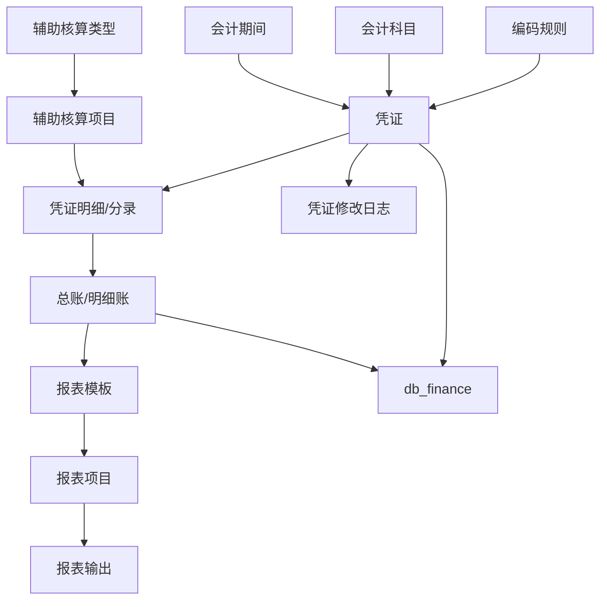
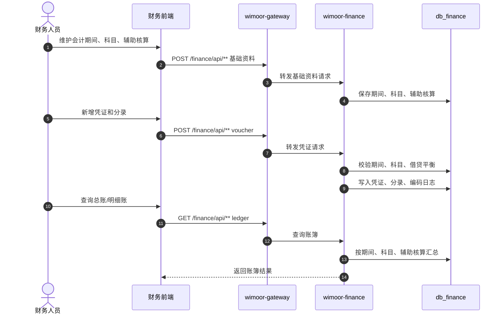

# 财务

财务能力由 `wimoor-modules/wimoor-finance` 承载，网关路径为 `/finance/**`。它提供会计期间、科目、辅助核算、凭证、账簿、报表模板和编码规则等基础财务能力。

## 功能范围

- 会计期间。
- 会计科目。
- 辅助核算类型和项目。
- 凭证、凭证明细和凭证修改日志。
- 总账、明细账。
- 报表模板和报表项目。
- 编码规则、编码缓存和编码生成日志。

## 模块边界

| 层级 | 位置 | 职责 |
| --- | --- | --- |
| 前端 API | `wimoorui/src/api/finance` | 会计期间、科目、凭证、账簿、报表请求 |
| 前端路由 | `wimoorui/src/router/modules/finance.js` | 财务相关工具页面入口 |
| 后端服务 | `wimoor-modules/wimoor-finance` | 财务 Controller、Service、Mapper |
| 数据库 | `db_finance` | 科目、辅助核算、凭证、分录、账簿、模板 |
| 编码能力 | code rule/cache/log | 生成凭证号、单据号等编号 |

## 财务数据流图

## 制证和账簿时序图

## 报表生成流程图

## 关键数据和接口

| 类型 | 说明 |
| --- | --- |
| 网关路径 | `/finance/**` |
| API 前缀 | `/finance/api/**` |
| 主要 API 家族 | periods、subjects、auxiliary items/types、vouchers、entries、ledgers、report templates/items、code cache/rules |
| 主要数据库 | `db_finance` |
| 端口注意 | 当前配置中 `wimoor-finance` 与 `wimoor-ozon` 同为 `8106`，本地同时启动前必须调整端口 |

## 排错关注点

- 凭证保存失败：检查会计期间是否开启、科目是否启用、借贷是否平衡。
- 明细账为空：检查凭证状态、期间条件、科目和辅助核算过滤条件。
- 报表结果不正确：检查模板项目、取数规则、期间和账簿汇总口径。
- 编码重复：检查编码规则、编码缓存和并发生成日志。
