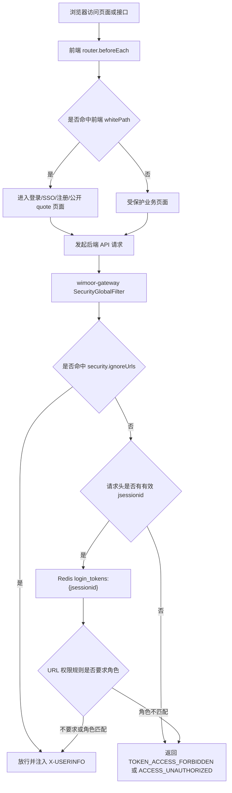
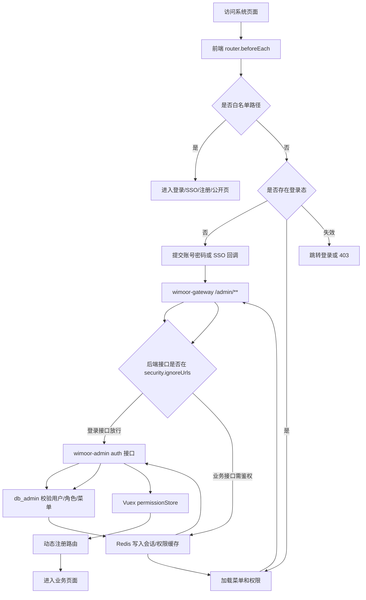
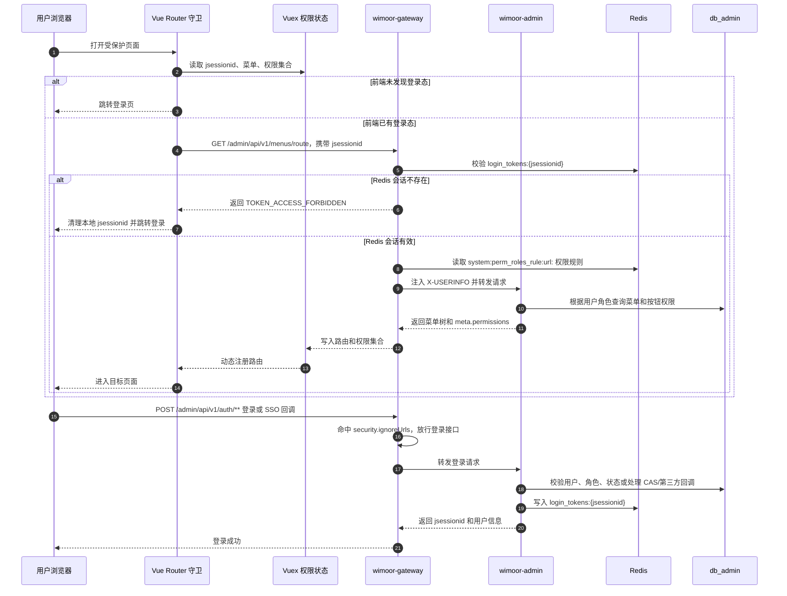
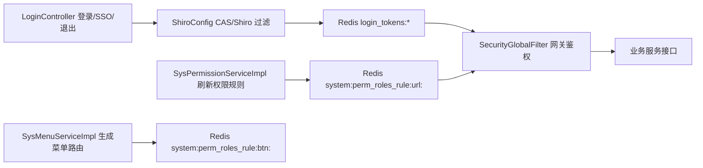
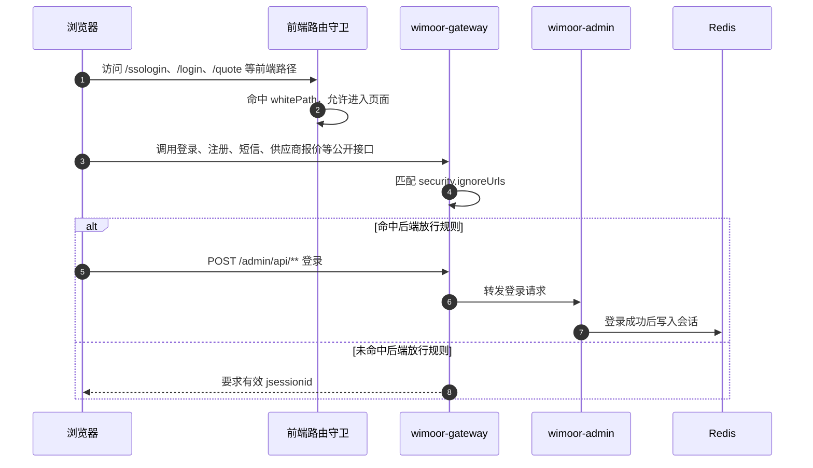
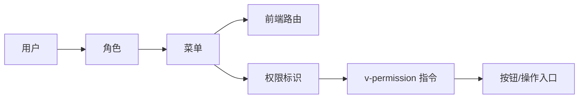

# 登录与权限

登录与权限能力主要由 `wimoor-admin`、`wimoor-gateway`、前端路由守卫和 Redis 缓存共同完成。它决定用户能否进入系统、能看到哪些菜单、能调用哪些按钮级权限。

## 能力范围

- 登录、SSO 登录、退出。
- 用户、角色、菜单、权限管理。
- 字典、标签、部门、数据权限。
- 前端动态路由和权限指令。
- Redis 会话和权限缓存。
- 网关白名单与后端接口鉴权。

## 模块边界

| 层级 | 位置 | 职责 |
| --- | --- | --- |
| 前端路由 | `wimoorui/src/router/index.js` | 白名单判断、登录态检查、动态路由注册 |
| 前端状态 | `wimoorui/src/store/modules/permission.js` | 保存菜单、路由和按钮权限集合 |
| 前端指令 | `wimoorui/src/directive/permission.js` | 控制按钮、操作入口显示 |
| 网关 | `wimoor-gateway` | 统一入口、转发 `/admin/**` 等后端路径 |
| Admin 服务 | `wimoor-admin/admin-boot` | auth、user、role、menu、permission、dict 等 API |
| 缓存 | Redis | token、会话、权限、字典等缓存 |
| 数据库 | `db_admin` | 用户、角色、菜单、权限、字典等基础数据 |

## 前后端分工

这里有两套“白名单”，职责不同，不能混为一谈。

| 层级 | 白名单来源 | 作用 | 是否安全边界 |
| --- | --- | --- | --- |
| 前端页面白名单 | `wimoorui/src/router/index.js` 的 `whitePath` | 控制 Vue 页面是否直接进入，还是跳转登录页 | 否，只是页面导航和用户体验 |
| 网关接口白名单 | Nacos `wimoor-gateway` 配置的 `security.ignoreUrls` | 控制哪些 HTTP 接口不需要 `jsessionid` 也能通过网关 | 是，网关是外部 API 入口的第一道校验 |
| Admin Shiro/CAS | `wimoor-admin/admin-boot` 的 `ShiroConfig`、`LoginController` | 处理 SSO、CAS 回调、登录会话、退出 | 是，负责认证和会话建立 |
| Admin 权限数据 | `SysMenuServiceImpl`、`SysPermissionServiceImpl` | 生成菜单、按钮权限、URL 权限和角色关系 | 是，网关鉴权依赖这些权限规则 |

结论：前端不能“解决”接口拦截，只能提前把未登录用户引导到登录页。真正防止未授权接口访问的是 `wimoor-gateway` 的 `SecurityGlobalFilter`，以及 Admin 写入 Redis 的登录态和权限规则。

## 两层白名单示意图

## 主流程图

## 登录与接口鉴权时序图

## 后端鉴权职责图

## 白名单访问时序图

## 菜单与按钮权限流

## 关键接口和数据

| 类型 | 说明 |
| --- | --- |
| 网关路径 | `/admin/**` |
| 主要 API 家族 | auth、users、roles、menus、permissions、dicts、files、tags、quartz |
| 主要数据库 | `db_admin`，Quartz 持久化使用 `db_quartz` |
| 登录会话缓存 | Redis `login_tokens:{jsessionid}`，由 Admin 写入，由 Gateway 校验 |
| URL 权限缓存 | Redis `system:perm_roles_rule:url:`，由 Admin 权限服务刷新，由 Gateway 匹配 |
| 按钮权限缓存 | Redis `system:perm_roles_rule:btn:`，由 Admin 权限服务刷新，前端按菜单返回的权限集合控制展示 |
| 前端白名单 | `/ssologin`、`/authresult`、`/login`、`/register`、`/resetPassword`、`/quote` |
| 后端放行规则 | Nacos `wimoor-gateway` 的 `security.ignoreUrls`，包含 `/admin/api/v1/auth/**`、注册、短信、授权回调、Webhook、供应商报价提交等 |

## 排错关注点

- 登录页能打开但登录失败：先看 `/admin/**` 是否能经网关转发到 `wimoor-admin`。
- 登录页能打开但接口 403：前端白名单只代表页面可访问，继续检查网关 `security.ignoreUrls` 是否包含对应接口。
- 登录成功后菜单为空：检查用户角色、角色菜单关系、菜单状态和 Admin 返回的 `meta.permissions`。
- 接口提示未登录：检查请求头 `jsessionid`、Redis `login_tokens:{jsessionid}` 是否存在，以及会话是否过期。
- 接口提示无权限：检查 `t_sys_permission.url_perm`、角色权限关系，以及 Redis `system:perm_roles_rule:url:` 是否已刷新。
- 页面能打开但按钮不显示：检查后端权限标识和前端 `v-permission` 使用的权限码是否一致。
- 刷新页面后跳回登录：检查 `jsessionid` 存储、Redis 连接和网关鉴权白名单。
- SSO 回调失败：检查回调 URL、前端白名单和 Admin 端授权配置。
