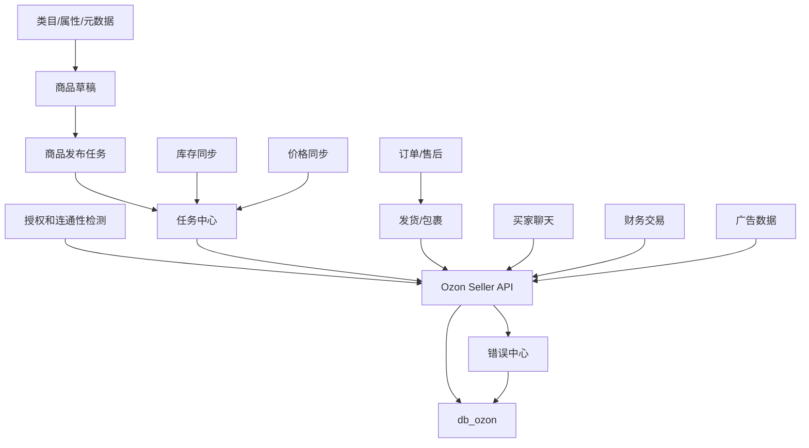
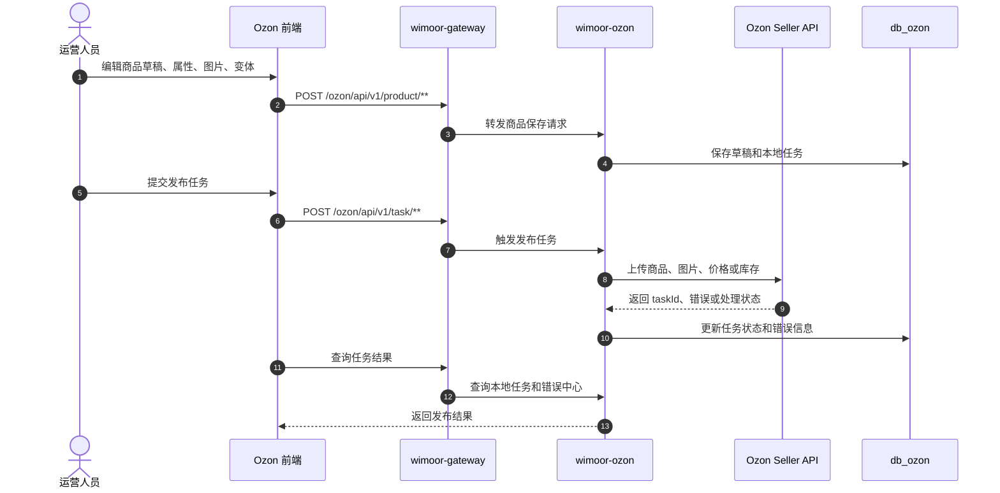
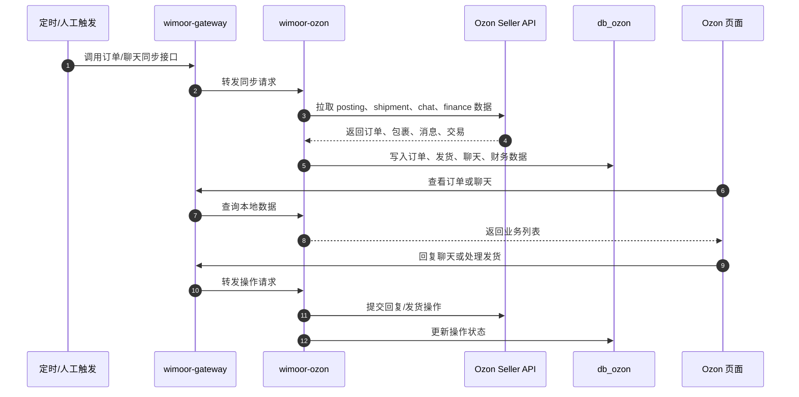

# Ozon

Ozon 能力由 `wimoor-ozon/ozon-boot` 承载，网关路径为 `/ozon/**`。它负责 Ozon 店铺授权、商品发布、库存价格同步、订单发货、聊天、财务、广告、错误中心和任务同步。

## 功能范围

- 店铺授权和连通性检测。
- 商品草稿、属性、图片、变体和发布任务。
- 库存推送、库存快照和库存任务。
- 价格同步、价格任务和价格快照。
- 订单、售后、发货和包裹。
- 买家聊天、回复审核和会话同步。
- 财务交易、广告、错误中心、元数据和运维操作。

## 模块边界

| 层级 | 位置 | 职责 |
| --- | --- | --- |
| 前端 API | `wimoorui/src/api/ozon` | Ozon 授权、商品、库存、价格、聊天、订单、任务请求 |
| 前端路由 | `wimoorui/src/router/modules/ozon.js` | auth、product、stock、price、chat、ads、finance、posting、shipment、task、error |
| 后端服务 | `wimoor-ozon/ozon-boot` | Ozon Controller、Service、任务入口 |
| Feign | `wimoor-api/wimoor-api-ozon` | Ozon 远程服务契约 |
| 数据库 | `db_ozon` | 授权、商品、库存、价格、订单、聊天、财务、任务数据 |
| 外部 API | Ozon Seller API | 商品、库存、订单、聊天、财务等接口 |

## 总体流程图

## 商品发布时序图

## 订单发货和聊天时序图

## 关键数据和接口

| 类型 | 说明 |
| --- | --- |
| 网关路径 | `/ozon/**` |
| API 前缀 | `/ozon/api/v1/**` |
| 主要 API 家族 | auth、product、stock、price、posting、shipment、chat、finance、ads、meta、ops、error、task |
| 主要数据库 | `db_ozon` |
| 外部依赖 | Ozon Seller API |
| 端口注意 | 当前配置中 `wimoor-ozon` 与 `wimoor-finance` 同为 `8106`，本地同时启动前必须调整端口 |

## 排错关注点

- Ozon 授权失败：检查 client id、api key、店铺状态和连通性检测接口。
- 商品发布失败：优先看错误中心，确认类目属性、图片、价格、库存是否满足 Ozon 要求。
- 库存价格不同步：检查任务中心状态、Ozon API 返回错误和本地库存来源。
- 订单发货缺数据：检查订单同步时间范围、店铺授权和 Ozon 返回分页。
- 聊天无法回复：检查会话状态、回复审核规则和 Ozon API 错误码。
