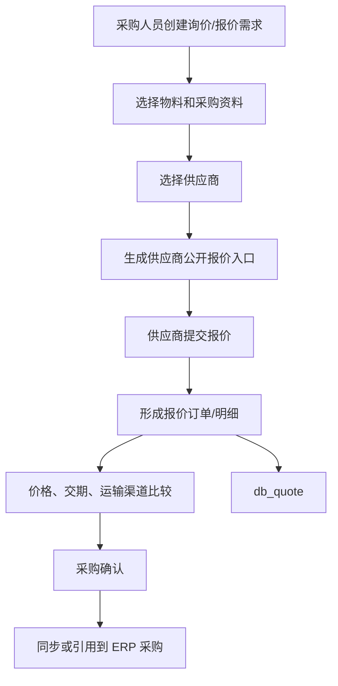
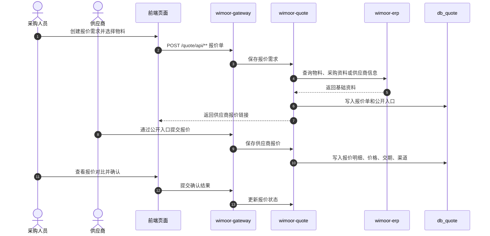
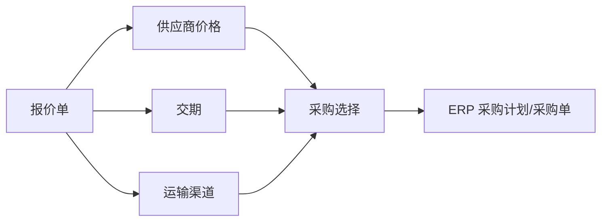

# 报价

报价能力由 `wimoor-modules/wimoor-quote` 承载，网关路径为 `/quote/**`。它用于供应商报价、采购报价单、报价订单和运输渠道管理，并为 ERP 采购提供供应商价格参考。

## 功能范围

- 供应商报价。
- 采购报价单。
- 报价订单。
- 运输渠道。
- 供应商公开报价入口。
- 与 ERP 采购资料、物料和供应商选择协作。

## 模块边界

| 层级 | 位置 | 职责 |
| --- | --- | --- |
| 前端 API | `wimoorui/src/api/quote` | 报价单、供应商报价、运输渠道请求 |
| 后端服务 | `wimoor-modules/wimoor-quote` | Quote Controller、Service、Mapper |
| Feign | `wimoor-api/wimoor-api-quote` | 保存报价等跨服务契约 |
| 数据库 | `db_quote` | 报价单、报价明细、供应商报价、运输渠道 |
| 关联模块 | `wimoor-erp` | 物料、采购资料、供应商选择 |

## 报价业务流程图

## 供应商报价时序图

## 报价到采购关系图

## 关键数据和接口

| 类型 | 说明 |
| --- | --- |
| 网关路径 | `/quote/**` |
| API 前缀 | `/quote/api/**` |
| 主要 API 家族 | supplier quote、purchase quote、shipment quote |
| 主要数据库 | `db_quote` |
| 公开路径 | 网关配置中存在 quote supplier public path 放行，用于供应商提交报价 |

## 排错关注点

- 供应商公开链接打不开：检查网关白名单、公开路径和报价单状态。
- 报价保存失败：检查供应商、物料、币种、价格和交期字段完整性。
- ERP 无法引用报价：检查报价状态、物料编码和 ERP 采购资料关联。
- 报价对比不准确：检查币种、税率、运费、最小起订量和运输渠道。
