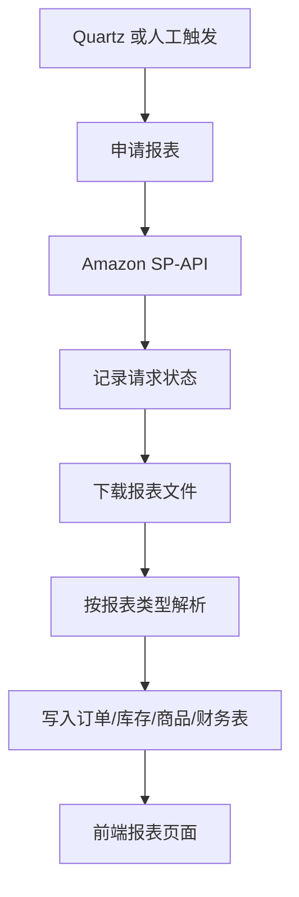

# Amazon 报表流程

```mermaid
flowchart TB
  trigger["Quartz 或人工触发"]
  request["申请报表"]
  amazon["Amazon SP-API"]
  record["记录请求状态"]
  download["下载报表文件"]
  parse["按报表类型解析"]
  save["写入订单/库存/商品/财务表"]
  page["前端报表页面"]

  trigger --> request --> amazon --> record
  record --> download --> parse --> save --> page
```

