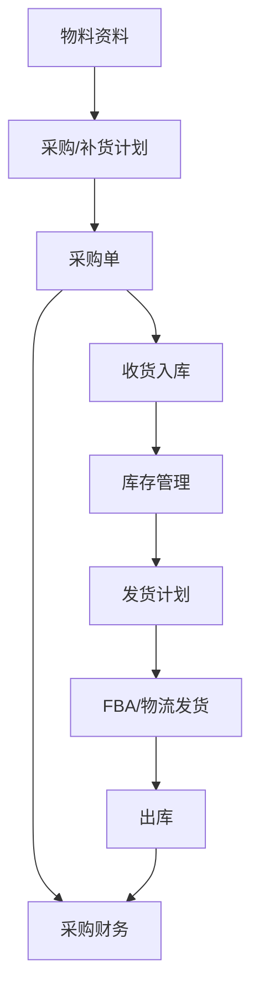

# ERP 采购发货流程

```mermaid
flowchart TB
  material["物料资料"]
  plan["采购/补货计划"]
  purchase["采购单"]
  receive["收货入库"]
  inventory["库存管理"]
  shipPlan["发货计划"]
  shipment["FBA/物流发货"]
  outbound["出库"]
  finance["采购财务"]

  material --> plan --> purchase --> receive --> inventory
  inventory --> shipPlan --> shipment --> outbound
  purchase --> finance
  outbound --> finance
```

