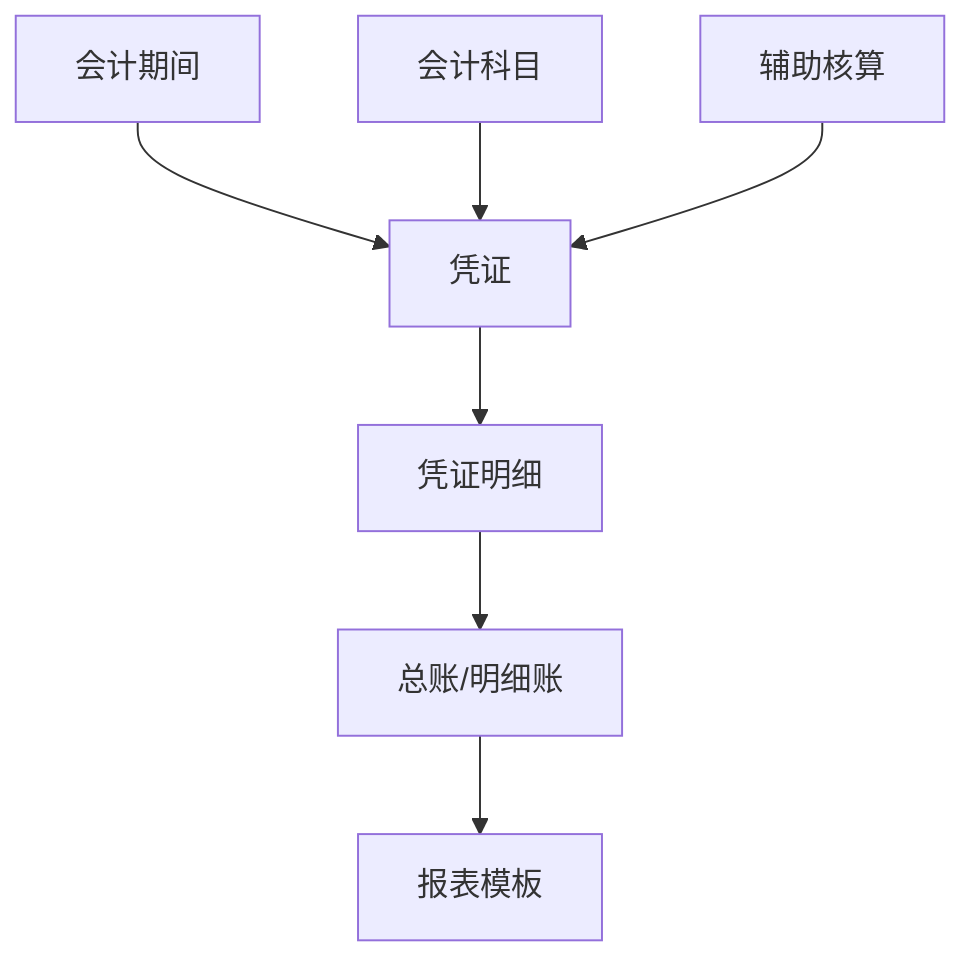

# 财务流程

```mermaid
flowchart TB
  period["会计期间"]
  subject["会计科目"]
  aux["辅助核算"]
  voucher["凭证"]
  entry["凭证明细"]
  ledger["总账/明细账"]
  report["报表模板"]

  period --> voucher
  subject --> voucher
  aux --> voucher
  voucher --> entry --> ledger --> report
```

