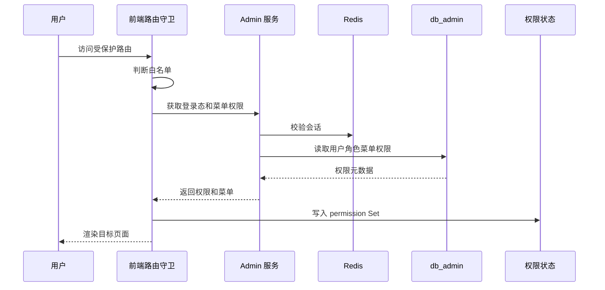

# 登录鉴权时序

```mermaid
sequenceDiagram
  participant User as 用户
  participant Router as 前端路由守卫
  participant Admin as Admin 服务
  participant Redis as Redis
  participant DB as db_admin
  participant Store as 权限状态
  User->>Router: 访问受保护路由
  Router->>Router: 判断白名单
  Router->>Admin: 获取登录态和菜单权限
  Admin->>Redis: 校验会话
  Admin->>DB: 读取用户角色菜单权限
  DB-->>Admin: 权限元数据
  Admin-->>Router: 返回权限和菜单
  Router->>Store: 写入 permission Set
  Router-->>User: 渲染目标页面
```

