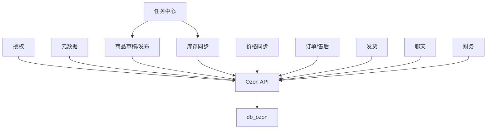

# Ozon 流程

```mermaid
flowchart TB
  auth["授权"]
  meta["元数据"]
  product["商品草稿/发布"]
  stock["库存同步"]
  price["价格同步"]
  posting["订单/售后"]
  shipment["发货"]
  chat["聊天"]
  finance["财务"]
  task["任务中心"]
  db["db_ozon"]
  api["Ozon API"]

  auth --> api
  meta --> api
  product --> api
  stock --> api
  price --> api
  posting --> api
  shipment --> api
  chat --> api
  finance --> api
  task --> product
  task --> stock
  api --> db
```

