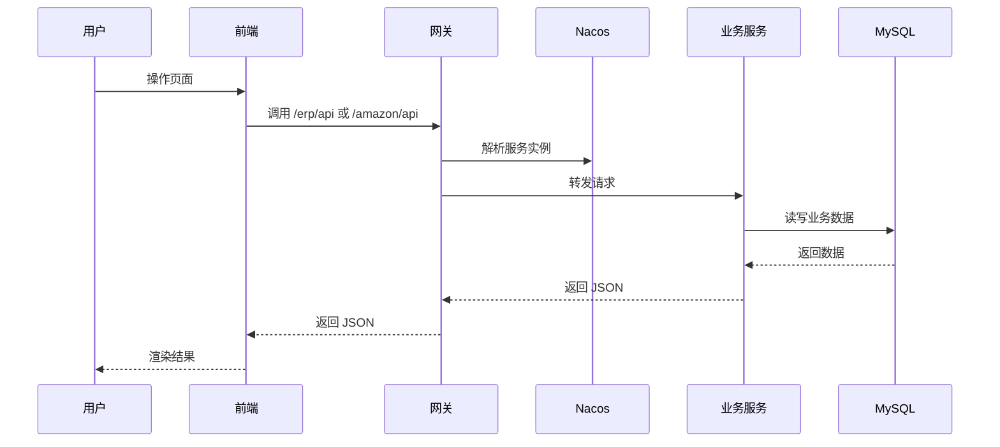

# 请求时序

```mermaid
sequenceDiagram
  participant User as 用户
  participant UI as 前端
  participant Gateway as 网关
  participant Nacos as Nacos
  participant Service as 业务服务
  participant DB as MySQL
  User->>UI: 操作页面
  UI->>Gateway: 调用 /erp/api 或 /amazon/api
  Gateway->>Nacos: 解析服务实例
  Gateway->>Service: 转发请求
  Service->>DB: 读写业务数据
  DB-->>Service: 返回数据
  Service-->>Gateway: 返回 JSON
  Gateway-->>UI: 返回 JSON
  UI-->>User: 渲染结果
```

