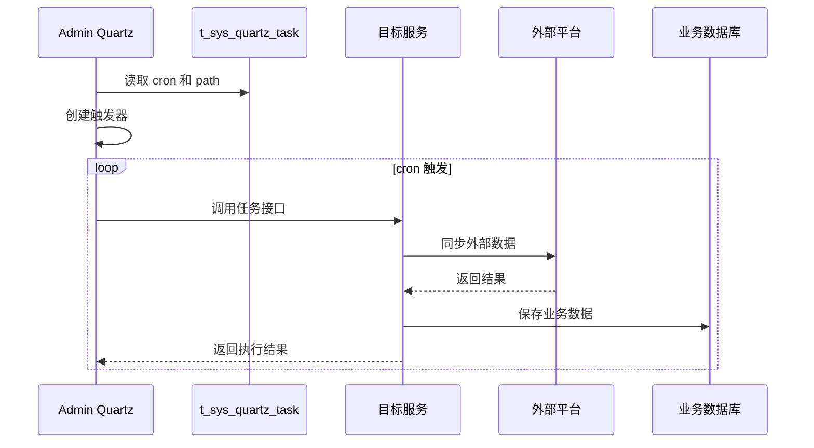

# Quartz 任务时序

```mermaid
sequenceDiagram
  participant Quartz as Admin Quartz
  participant Task as t_sys_quartz_task
  participant Target as 目标服务
  participant External as 外部平台
  participant DB as 业务数据库
  Quartz->>Task: 读取 cron 和 path
  Quartz->>Quartz: 创建触发器
  loop cron 触发
    Quartz->>Target: 调用任务接口
    Target->>External: 同步外部数据
    External-->>Target: 返回结果
    Target->>DB: 保存业务数据
    Target-->>Quartz: 返回执行结果
  end
```

