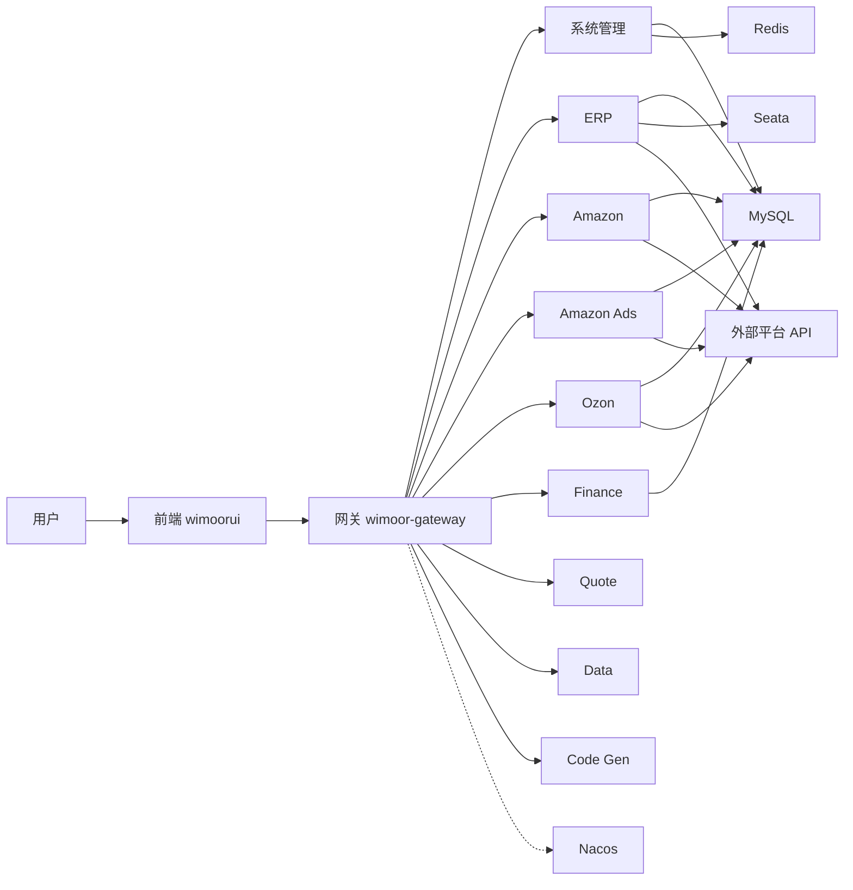

# 系统上下文

```mermaid
flowchart LR
  user["用户"]
  ui["前端 wimoorui"]
  gateway["网关 wimoor-gateway"]
  admin["系统管理"]
  erp["ERP"]
  amazon["Amazon"]
  adv["Amazon Ads"]
  ozon["Ozon"]
  finance["Finance"]
  quote["Quote"]
  data["Data"]
  gen["Code Gen"]
  mysql["MySQL"]
  redis["Redis"]
  nacos["Nacos"]
  seata["Seata"]
  external["外部平台 API"]

  user --> ui --> gateway
  gateway --> admin
  gateway --> erp
  gateway --> amazon
  gateway --> adv
  gateway --> ozon
  gateway --> finance
  gateway --> quote
  gateway --> data
  gateway --> gen
  admin --> mysql
  erp --> mysql
  amazon --> mysql
  adv --> mysql
  ozon --> mysql
  finance --> mysql
  admin --> redis
  erp --> seata
  amazon --> external
  adv --> external
  ozon --> external
  erp --> external
  gateway -.-> nacos
```

