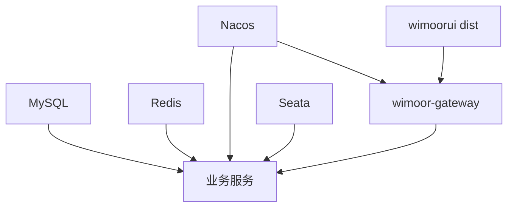

# 部署

## 部署组件

## 推荐步骤

1. 准备 MySQL、Redis、Nacos、Seata。
2. 导入 `init-config/mysql/数据库结构` 下的结构 SQL。
3. 导入 `init-config/mysql/数据` 下的基础数据。
4. 导入 `init-config/nacos/DEFAULT_GROUP` 配置。
5. 按启动顺序启动网关和业务服务。
6. 构建前端并部署 `wimoorui/dist`。
7. 通过网关路径访问后端 API。

## 部署注意

- 生产环境不要使用示例密钥。
- 网关路径和前端代理路径必须一致。
- 如果同时运行 Ozon 和 Finance，需要先解决端口冲突。
- Quartz 任务依赖 `db_admin` 中任务种子数据和 `db_quartz` 调度表。

