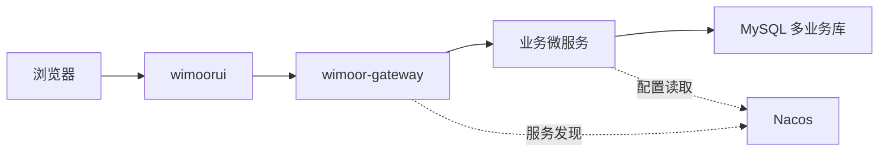

# 项目概览

Wimoor 仓库由后端 Maven 多模块和前端 Vite 工程组成。根目录 `pom.xml` 聚合 `wimoor-common`、`wimoor-admin`、`wimoor-gateway`、`wimoor-erp`、`wimoor-amazon`、`wimoor-amazon-adv`、`wimoor-ozon`、`wimoor-api`、`wimoor-modules`。

## 目录分层

| 目录 | 说明 |
| --- | --- |
| `wimoorui` | Vue 3 + Vite 前端应用 |
| `wimoor-gateway` | Spring Cloud Gateway 网关 |
| `wimoor-admin` | 登录、权限、系统管理、Quartz 任务管理 |
| `wimoor-erp` | ERP 核心业务，含物料、采购、仓库、库存、发货 |
| `wimoor-amazon` | Amazon 店铺、订单、报表、商品、FBA、结算 |
| `wimoor-amazon-adv` | Amazon Ads 广告、报表、发票 |
| `wimoor-ozon` | Ozon 平台本地业务 |
| `wimoor-modules` | Quote、Data、Gen、Finance 等扩展服务 |
| `wimoor-common` | 公共核心、MVC、Redis、MyBatis、存储、Swagger |
| `wimoor-api` | 跨服务 Feign 契约 |
| `init-config` | MySQL、Nacos、Seata、浏览器插件等初始化配置 |

## 运行视角

更完整的架构索引见 [项目地图](../../../project-map/README.md)。

