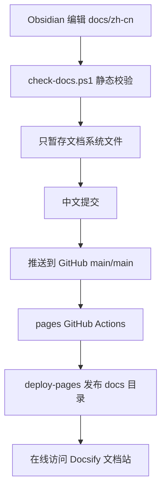

# GitHub Pages 发布流程

Wimoor 文档采用 `Obsidian + Docsify + GitHub Pages` 模式：

- Obsidian 负责本地编辑和知识图谱。
- Docsify 负责把 Markdown 在线渲染为文档站点。
- GitHub Pages 通过 `pages` workflow 托管 `docs` 目录。

## 一次性 Pages 设置

在 GitHub 仓库中进入：

`Settings -> Pages -> Build and deployment -> Source`

选择：

| 配置项 | 值 |
| --- | --- |
| Source | `GitHub Actions` |

本仓库已提供 `.github/workflows/pages.yml`，该 workflow 会执行文档校验，自动启用 Pages，然后把 `docs` 目录上传并部署到 GitHub Pages。

保存后，站点默认访问地址为：

- `https://likangjie110.github.io/Wimoor---/`
- `https://likangjie110.github.io/Wimoor---/zh-cn/#/`

## 本地预览

在仓库根目录运行：

```powershell
tools/docs/serve-docs.ps1
```

默认访问：

- `http://localhost:3000/`
- `http://localhost:3000/zh-cn/#/`

## 发布前检查

```powershell
tools/docs/check-docs.ps1
```

检查内容包括：

- 核心入口文件是否存在。
- Markdown 代码围栏是否成对。
- Mermaid 图表块是否可识别。
- 文档相对链接是否指向存在的本地文件。
- 是否出现疑似明文敏感配置。
- `docs/index.html` 是否使用兼容 GitHub Pages 子路径的动态内容路径。

## 一键提交推送

```powershell
tools/docs/publish-docs.ps1 -Message "docs: 完善 Obsidian 与 Pages 文档发布"
```

脚本会执行：

1. 运行文档检查。
2. 确认暂存区为空，避免混入用户其他改动。
3. 只暂存文档系统范围。
4. 校验暂存文件不包含业务代码、`docs/ui`、`docs/superpowers` 等无关路径。
5. 使用中文提交信息提交。
6. 推送到远程 `main` 的 `main` 分支。

## 发布流程图



## 暂存范围

发布脚本只允许暂存这些路径：

- `.gitignore`
- `.github/workflows/docs-verify.yml`
- `.github/workflows/pages.yml`
- `docs/.nojekyll`
- `docs/index.html`
- `docs/zh-cn/**`
- `docs/project-map/**`
- `tools/docs/**`

如果暂存区已有其他文件，脚本会停止。先提交或取消暂存其他工作后再发布文档。

## 常见问题

| 现象 | 处理方式 |
| --- | --- |
| Pages 访问 404 | 先检查 `pages` workflow 是否执行成功；如果 `configure-pages` 提示 Pages 未启用，再到 Settings -> Pages 选择 `GitHub Actions` |
| `_sidebar.md` 不加载 | 确认 `docs/.nojekyll` 已提交 |
| 本地能看，线上路径错 | 确认使用最新 `docs/index.html` 动态 `basePath` |
| 脚本拒绝提交 | 执行 `git diff --cached --name-only` 查看是否已有非文档暂存 |
| 图表不显示 | 检查 Mermaid 围栏和浏览器控制台错误 |
