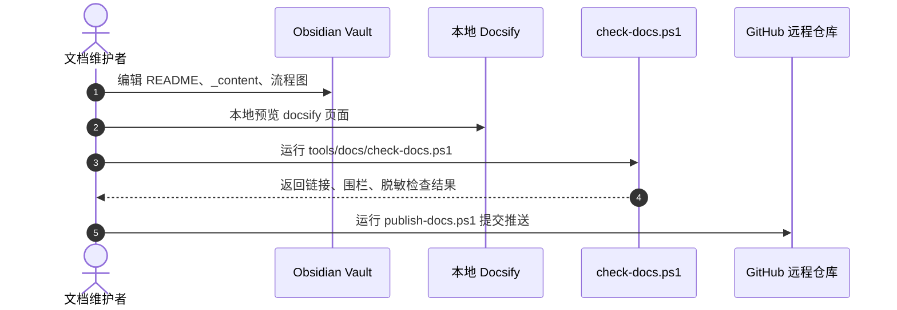

# Obsidian 维护规范

`docs/zh-cn` 是 Wimoor 中文说明文档的 Obsidian 本地知识库根目录，同时也是 Docsify 在线站点的内容目录。

## 打开方式

1. 打开 Obsidian。
2. 选择“打开本地文件夹作为仓库”。
3. 选择 `D:\project\wimoor\docs\zh-cn`。
4. 进入后从 `README.md` 开始维护文档。

## 目录约定

| 目录或文件 | 用途 |
| --- | --- |
| `README.md` | Docsify 首页，也是 Obsidian 入口页 |
| `_sidebar.md` | Docsify 侧边栏目录 |
| `_navbar.md` | Docsify 顶部导航 |
| `_content/introduction` | 项目概览、环境、编译、配置、部署 |
| `_content/ability` | 功能说明和业务流程图 |
| `_content/theory` | 架构、鉴权、网关、数据库、事务等原理 |
| `_content/flows` | 集中流程图和时序图 |
| `_content/skill` | 维护、发布、排错和脱敏规则 |
| `_content/reference` | 服务、接口、数据库、Nacos、Quartz 索引入口 |

## 链接规则

- 使用 Markdown 相对链接：`[项目概览](../introduction/overview.md)`。
- 不使用 `[[WikiLinks]]`，避免 Docsify 在线站点无法直接识别。
- 链接到项目地图时使用相对路径，例如 `[项目地图](../../../project-map/README.md)`。
- 图片和附件放在文档相邻目录或专门附件目录后再用相对路径引用。
- 修改文件名或目录名后，同步更新 `_sidebar.md`、`_navbar.md` 和相关正文链接。

## 图表规则

文档图表使用 Mermaid，Obsidian 和 Docsify 都能阅读：

## 维护流程

## 本地状态文件

Obsidian 会生成 `.obsidian/`、`.trash/` 等个人状态目录。这些目录已在 `.gitignore` 中忽略，不应提交到仓库，也不会参与 GitHub Pages 发布。

## 更新原则

- 事实变化先更新 `docs/project-map` 技术索引，再同步中文说明页。
- 涉及配置值时只写键名和用途，敏感值写为 `<redacted>`。
- 功能页需要同时说明业务范围、模块边界、关键流程图、时序图和排错点。
- 线上发布前运行文档检查脚本，避免 broken link、Mermaid 围栏错误和凭据泄漏。
