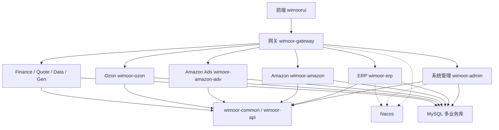

# 系统架构

Wimoor 采用前后端分离和微服务分层。前端负责页面、路由、权限展示和 API 调用；网关负责路径转发；业务服务按领域拆分；公共能力放在 `wimoor-common` 和各 `*-api` 契约模块中。

```mermaid
flowchart TB
  ui["前端 wimoorui"]
  gateway["网关 wimoor-gateway"]
  admin["系统管理 wimoor-admin"]
  erp["ERP wimoor-erp"]
  amazon["Amazon wimoor-amazon"]
  adv["Amazon Ads wimoor-amazon-adv"]
  ozon["Ozon wimoor-ozon"]
  modules["Finance / Quote / Data / Gen"]
  common["wimoor-common / wimoor-api"]
  mysql["MySQL 多业务库"]
  nacos["Nacos"]

  ui --> gateway
  gateway --> admin
  gateway --> erp
  gateway --> amazon
  gateway --> adv
  gateway --> ozon
  gateway --> modules
  admin --> common
  erp --> common
  amazon --> common
  adv --> common
  ozon --> common
  modules --> common
  admin --> mysql
  erp --> mysql
  amazon --> mysql
  adv --> mysql
  ozon --> mysql
  modules --> mysql
  gateway -.-> nacos
  admin -.-> nacos
  erp -.-> nacos
```

详细服务表见 [服务索引](../reference/services.md)。

