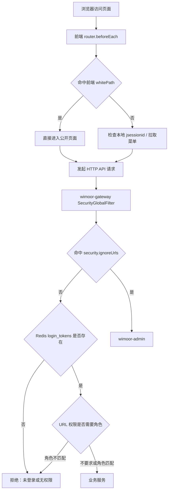
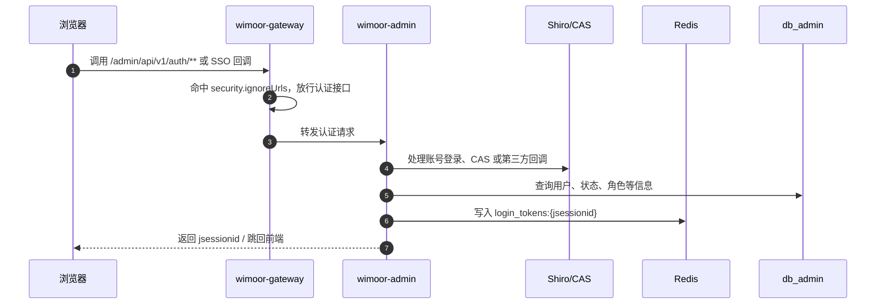
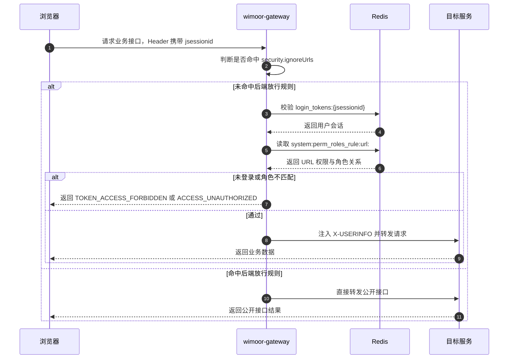

# 登录鉴权

登录鉴权不是单靠前端白名单完成的。Wimoor 采用“前端路由引导 + 网关接口拦截 + Admin 认证授权 + Redis 会话/权限缓存”的分层模型。

## 职责边界

| 层级 | 负责什么 | 不负责什么 |
| --- | --- | --- |
| 前端路由守卫 | 判断页面是否在 `whitePath`，未登录时跳转登录页，登录后动态注册路由 | 不防止用户绕过页面直接调用接口 |
| 网关 `SecurityGlobalFilter` | 校验接口是否在 `security.ignoreUrls`，校验 `jsessionid`，校验 URL 权限角色 | 不生成用户、角色、菜单和权限数据 |
| Admin 登录/SSO | 处理账号登录、CAS/SSO 回调、退出，写入 Redis 登录会话 | 不直接承载所有业务接口 |
| Admin 菜单权限 | 生成菜单路由、按钮权限、URL 权限和角色关系 | 不替代网关的每次接口拦截 |
| Redis | 保存 `login_tokens:*`、URL 权限规则、按钮权限规则 | 不做业务判断，只提供会话和权限缓存数据 |

## 关键结论

- `whitePath` 是前端页面白名单，只影响 Vue 路由跳转。
- `security.ignoreUrls` 是后端接口白名单，配置在 Nacos `wimoor-gateway` 中。
- 没有命中 `security.ignoreUrls` 的接口必须携带有效 `jsessionid`。
- 网关通过 Redis `login_tokens:{jsessionid}` 判断是否登录。
- 网关通过 Redis `system:perm_roles_rule:url:` 判断 URL 是否需要角色权限。
- Admin 负责登录态写入、菜单路由返回和权限规则刷新。

## 鉴权链路图

## 登录态建立时序

## 受保护接口访问时序

## 常见误区

- “前端白名单放行了，就不需要后端放行”：错误。页面能打开不代表接口能通过网关。
- “按钮隐藏就是权限控制完成”：不完整。按钮隐藏是体验控制，接口权限仍应由网关 URL 权限规则约束。
- “只要 localStorage 有 `jsessionid` 就是已登录”：不完整。网关还会检查 Redis `login_tokens:{jsessionid}` 是否存在且匹配。
- “菜单权限只在前端用”：不完整。Admin 生成菜单和按钮权限给前端，同时刷新 URL 权限规则给网关使用。
