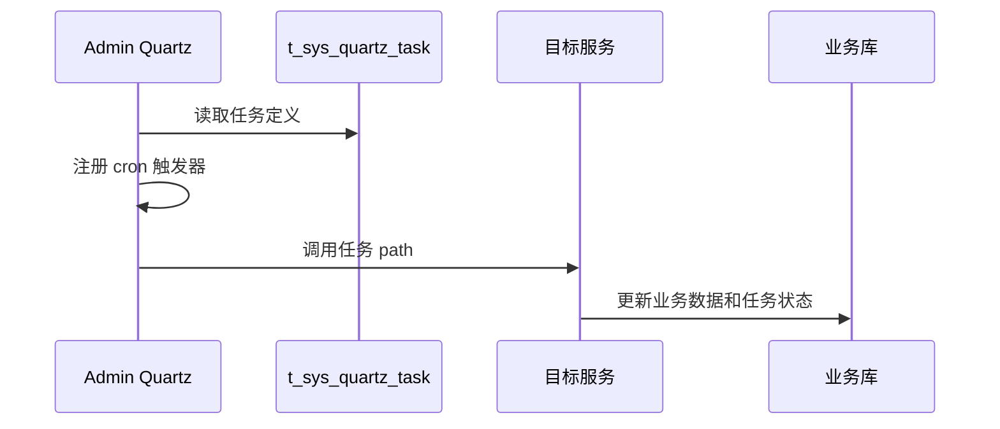

# 定时任务

定时任务由 Admin 服务的 Quartz JDBC store 承载，任务种子数据来自 `init-config/mysql/数据/db_admin/t_sys_quartz_task.sql`。

## 调用模型

## 当前任务分布

种子任务主要目标服务为 `wimoor-amazon`、`wimoor-amazon-adv`、`wimoor-erp`。业务分组以 Amazon 报表、广告、商品、财务、订单为主。

