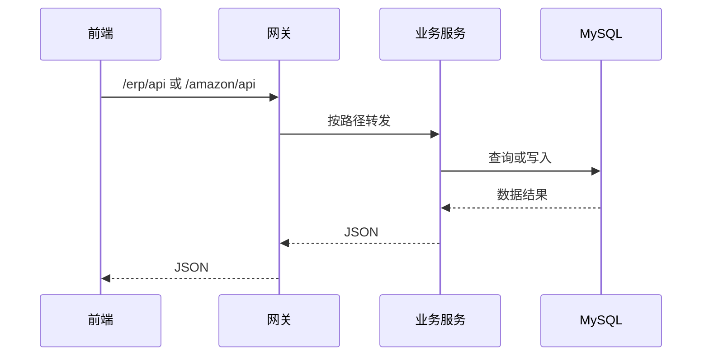

# 请求链路

## 开发环境

1. 浏览器访问 Vite dev server `8084`。
2. 前端 API 请求命中 `wimoorui/vite.config.js` 中的代理规则。
3. 代理转发到 `http://localhost:8099`。
4. `wimoor-gateway` 按路径路由到对应服务。
5. 服务执行 Controller -> Service -> Mapper -> MySQL。

## 生产环境

生产环境通常不经过 Vite dev proxy，前端静态资源由 Web 服务器提供，API 仍走网关路径。

